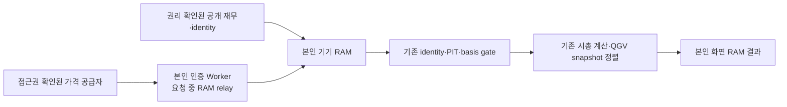

# M3 — 현재 종목군·순위의 개인 전용 경로 설계

작성일: **2026-10-10 UTC**. 기준 canonical: `ee039041ae7f5cb94e6a127930c7e43effb811ec`.
상태: **DESIGN_ONLY / CURRENT_UNIVERSE_UNKNOWN / PRIVATE_RUNTIME_NOT_CONNECTED**.

[GSQ-007~010](../pages_cockpit_owner/GOOGLE_SHEET_QUOTES_DECISION_REGISTER.md)의 최신 결정인 **무료·본인만 이용, 가격 및 가격 기반 파생값 공개 금지**를 적용한다. 기존 [PIPELINE_DESIGN](PIPELINE_DESIGN.md)의 M3 ‘일일 공개’는 이번 개인 경로의 목표가 아니다. 공개 Frozen 구성은 현재 구성으로 승격하지 않는다. 종목군·순위를 실제 산출하거나 가격 조회·저장·배포·정리를 실행하지 않는다.

## 목표와 기존 정책

권리가 확인된 입력을 본인 Worker/기기에서 휘발성으로 결합해 승인된 **US Market-Cap Top 500 PIT** 계산과 기존 QGV 순위를 개인 화면에 제공하는 경로다. S&P 500, TARGET19, 기존 Frozen500을 전체 후보 풀로 바꾸어 사용하지 않는다. TOP500 진입·탈락을 발견하려면 기존 500 밖의 적격 후보도 비교해야 한다.

시총 순위와 QGV 리더보드는 별개다. `universe/sources.py::mcap_top_n_snapshot`의 `shares × price`, 시총 내림차순·동률 `company_id` 오름차순을 계산 기준으로 보존한다. `qgv/leaderboard.py::LeaderboardEngine.build`는 기존 snapshot을 정렬하며 재점수하지 않는다. 새 Q/G/V 결합·가중치·시총/QGV 혼합순위·기술/Macro 점수 합성은 도입하지 않는다. 개인 가격을 사용하는 V와 가격을 결합한 QGV는 본인 화면에만 둔다.

[P02](../producer_infrastructure/PROPOSAL_P02_UNIVERSE_INTERIM_POLICY.md)의 Official 시점 사이 정책은 여전히 **NOT DECIDED / NOT IMPLEMENTED**다. 일일 재구성, carry-forward, 보간, 허용 staleness를 이 문서에서 선택하지 않는다. 개인 환경에서 계산한다는 이유로 Official reference·Promotion Gate·CA-UNIT 검증을 생략할 수 없다. 현재 후보의 개인 연구 결과와 Official 승격은 분리한다.

## 현재 연결 상태

| 구성 | canonical에서 확인된 범위 | M3에 남은 경계 |
| --- | --- | --- |
| `implementation/worker/src/index.js` | #88의 본인 인증·19개 심볼/6개 기간 allowlist·일봉 relay·no-store가 있다. tokeninfo 검증과 요청 제한을 사용한다. | 미국17·한국1·일본1의 차트 경로이며 전체 미국 후보·시총/주식 수·현재 종목군·QGV 계산기가 아니다. 코드 존재가 공급자 허가나 실제 배포 성공의 증거는 아니다. |
| `product/web_assets/private-history.js` | 클릭으로 개인 일봉을 받아 browser RAM에서 표시하는 경계가 있다. | 조회 응답을 Technical/Macro/QGV/종목군 계산에 연결한 runtime이 아니다. 완전한 PIT·기업행위·session 검증도 이 경로만으로 증명되지 않는다. |
| `universe/sources.py` | 순수 `mcap_top_n_snapshot` 및 Official constructor가 있다. | 가격의 최초 가용 시각·전체 후보 completeness·동시 session·basis 증거를 함수 자체가 입증하지 않는다. `official_mcap500_snapshot`도 `candidate_pool_complete=False`를 True로 바꾸지 않는다. |
| store/gate chain | `official_mcap500_snapshot_from_store`, `tools/run_top500_gate_chain.py` 등 과거 검증 경로가 있다. | 저장·보고·가격 산출물 경로를 개인 RAM 계산기로 실행하지 않는다. 필요한 기존 정책 검사를 휘발성 경계로 연결하는 후속 구현과 검토가 필요하다. |
| 공개 builder/bundle | 기존 Frozen 공개 경로가 있다. | GSQ-010의 코덱1 정리 과제와 별개다. 이 설계·문서 PR이 기존 공개 노출 차단을 완료한 것으로 보고하지 않는다. |

## 권장 배치 — 기기 계산, Worker는 본인 relay

기기가 재무·identity 입력과 가격을 결합하고 계산한다. Python의 기존 엔진은 계산·계약 대조 기준이며 browser에서 바로 실행되는 구현이 아니다. browser 이식 또는 본인 로컬 Python 실행 경계는 후속 코드 PR에서 같은 계약과 합성 비교로 검증해야 한다. 기존 provider/store/runner를 import하여 실제 수집·지속 저장을 시작하지 않는다.

Worker는 GSQ-008의 **Workers Free·비용 0·카드 없음** 조건 아래 본인 access token을 Google tokeninfo로 검증하고 허용된 공급자 요청만 중계하는 후보다. `aud`·본인 email·email_verified·만료를 모두 확인하며 exact Origin과 본인 인증을 함께 적용한다. 토큰은 공급자로 보내거나 저장·출력하지 않는다. 실제 OAuth 값·이메일·Secret은 문서/PR에 넣지 않는다.

Worker에서 전체 순위를 계산하는 대안도 개인 요청 RAM에서만 가능하지만, 전체 후보의 CPU·메모리·subrequests·payload·Free 한도 안에서 완료된다는 근거는 없다. **기기 계산을 우선 추천**하며 Worker 전체 batch 구현·상품 추가·유료 전환을 이번 설계에 포함하지 않는다. 기존 allowlist·속도·인증을 풀어서 M3를 연결하지 않는다. 차트 500회 예산은 전체 적격 후보 조사 예산과 다르며 기존 500회/일 예시로 전체 풀 제공을 약속할 수 없다.

## 입력과 gate

아래는 기존 계약에 필요한 증거와 개인 경계의 검사 요건이다. 새 계산법이나 자동 보정 정책은 아니다.

| 순서 | 요구 근거 | 부족하면 개인 화면에 표시할 상태 |
| --- | --- | --- |
| 1 접근권·비용 | 자동 조회·본인 Worker 중계·본인 가공·휘발성 처리 권리, 적용 계정/약관·free coverage·요청 예산 | 권리 미확인 출처는 조회를 시작하지 않는다. `SOURCE_NOT_CLEARED / NOT_AVAILABLE`. |
| 2 전체 후보·identity | 승인된 미국 적격 범위의 dated universe, issuer/security/listing와 ticker 변경·복수 클래스·ADR mapping, 후보 수/누락/포함·제외 근거 | subset은 명시할 수 있으나 현재 전체 Top500/전체 순위는 `UNKNOWN`. S&P/TARGET/Frozen membership 재사용으로 completeness를 채우지 않는다. |
| 3 주식 수·단위 | 같은 company/security/class 기준 shares, 통화·단위·측정시각·공시/가용 시각·정정 vintage, 필요한 CA-UNIT 근거 | 불명확 class를 합산하거나 대표 class 가격을 회사 전체 shares에 임의 곱하지 않는다. `INPUT_UNCONFIRMED`. |
| 4 가격·session | 명시된 가격시각·취득시각·통화·상장·raw/adjusted basis·완료 session, 실제 가용 시각과 cutoff 일치 | 취득시각을 과거 가용 시각으로 간주하지 않는다. 진행/지연/비동시 quote는 현재 PIT EOD가 아니며 `PIT_UNCONFIRMED / NOT_AVAILABLE`. |
| 5 기업행위·변환 | split/dividend/ADR·class·issuer-group 처리의 기존 승인 정책과 적용 범위, cutoff 당시 사용 가능한 자료 | 미래 split factor·사후 정정자료를 strict PIT 입력으로 사용하지 않는다. 기존 retrospective CA-UNIT 결과가 zero-lookahead 증거는 아니다. 새로운 환율/보정/단위 추정은 하지 않는다. |
| 6 전체 산출 가능성 | 적격 후보 모두의 필수 입력·동일 기준시점·연결 계약·완전성 근거 | missing 후보를 제거하고 남은 후보의 순위를 전체 미국 순위로 표시하지 않는다. Top500 전체 결과는 `UNKNOWN`. |
| 7 Official·모델 상태 | 기존 Official reference/승격 gate와 별도 정책 결정; 현재 QGV STANDARD v1 UNCALIBRATED 및 각 생산자 연구 상태 | label만 OFFICIAL/LIVE로 바꾸지 않는다. 개인 계산 결과도 검증되지 않은 모델 상태를 유지한다. |

`mcap_top_n_snapshot`은 missing/future/non-positive 후보를 제외하고 report를 반환한다. 이 exclusion 동작은 전체 순위의 완전성 인증이 아니므로 위 외부 gate 없이 report를 Official 현재 Top500로 받아들이면 안 된다. `UniverseEngine`의 기본 available_at 또는 `pit_shares`의 filed 날짜 기반 시각은 실제 intraday 공개/가용 증거를 대신하지 않는다.

QGV 정렬도 대상 membership 전원의 snapshot 존재·점수/coverage 유효성·cutoff/PIT·현재성 근거를 별도로 확인한다. `LeaderboardEngine.build`는 null 점수에도 rank를 부여하고 snapshot 시각을 검사하지 않으며, 기존 `IncrementalEngine`은 갱신 실패 시 과거 snapshot을 유지하고 없는 구성원은 순위에서 빠질 수 있다. 누락·null·미래 또는 갱신 실패로 유지된 과거 snapshot의 현재성이 미확인이라면 **현재 전체 QGV 순위는 `UNKNOWN`**이다. 기존 snapshot 정렬 성공을 전체 결과의 유효성으로 삼지 않으며 새 staleness 숫자·결측 보정·재점수 정책은 만들지 않는다.

휴장·여러 시장·주말·지연·장시간 순차 조회는 명시 session과 각 입력시각으로 처리한다. 같은 달력 날짜라는 이유로 동시 종가로 간주하거나 전일값·0·다른 상장 가격을 채우지 않는다. 통화/단위/basis가 맞지 않으면 실패한다. 현재 이 문서는 stale 허용 기간, FX 변환법, 후보 eligibility 예외를 정하지 않는다.

## 개인 작업 수명과 공개 경계

본인이 foreground 작업을 시작한 동안 입력·시총·가격 의존 V/QGV·순위·현재 선정 membership을 기기 RAM에서만 취급한다. 늦게 도착한 응답은 작업 ID·기준시각·회사/상장·입력 version이 현재 작업과 같을 때만 사용한다. 취소·로그아웃·화면 종료·회사/작업 전환 시 해당 RAM 참조를 해제하고 이전 결과로 대체하지 않는다. 공개 빌더에는 개인 결과의 입력이나 출력 경로를 만들지 않는다.

- **공개 금지:** 원가격·returns·시총·V·가격 결합 QGV·순위 및 그 순위에서 선정한 현재 Top500 구성 목록. 값이 없는 이름 목록도 개인 가격 순위의 산출물이면 공개하지 않는다. Git/Pages/public JSON/Actions 로그·아티팩트/PR 댓글로 보내지 않는다.
- **지속 저장 제외:** 가격/파생값의 파일·localStorage·IndexedDB·service worker cache·KV/D1/R2/Cache API·백업·오류/crash/관측 로그. Worker module-global 공유 price cache도 제외한다. no-store 헤더 하나만으로 모든 저장 경계가 검증됐다고 주장하지 않는다.
- **분리 유지:** 공개 SEC/DART 재무와 권리 확인된 identity 입력은 기존 경로를 유지할 수 있다. 공개 Frozen membership은 기존 historical reference이며 개인 현재 구성으로 덮어쓰지 않는다. private 시총 순위와 개인 가격 결합 결과를 재무 public bundle에 되돌리지 않는다.
- **오류/운영 정보:** 고정 비가격 reason code·개수·작업 상태만 최소 처리한다. 가격·회사별 순위·private 후보 목록·공급자 payload·토큰을 포함한 예외/log는 남기지 않는다. 기존 비가격 요청 제한 상태 저장은 가격 보관 허가가 아니다.

저장하지 않은 가격은 종료 후 과거 순위/QGV를 완전히 replay할 수 없다. hash·기준시각·source receipt만으로 값 재현이나 PIT/OOS/Calibration이 가능하다고 주장하지 않는다. 재현 검증과 연구용 저장이 필요하면 별도 권리·개인 저장 정책과 승인된 데이터 경계가 먼저 필요하다. 이 설계는 Holdout 선택·사용이나 검증용 가격 보관을 승인하지 않는다.

`universe/events.py`의 기존 PRICE 이벤트는 Technical만 dirty로 표시하고 FUNDAMENTAL 이벤트는 QGV를 갱신한다. 가격이 V 입력에 영향을 준다는 사실만으로 PRICE 이벤트를 QGV 매일 재계산·membership 갱신으로 바꾸는 정책이 승인된 것은 아니다. 새 자동 일정·QGV v2·계산 가중치 없이 기존 snapshot 정렬과 개인 입력 검증 경계를 설계한다.

## GSQ-007 공급자 순서와 남은 결정

Yahoo 비공식 chart는 최신 사용자 선택의 조사 1순위다. **무허가 자동 조회 부적합** 판정과 사용자 인지·수용을 유지한다. 개인용·저빈도·키 없음·Worker 인증·무저장이 공급자의 사전 허가를 대신하지 않는다. 따라서 실제 조회를 활성화하는 권리 근거는 미해소다. Yahoo 실패 시 Tiingo 미국/KRX 한국의 조건을 확인하고, 본인 Sheet 현재가/수동 입력을 검토한다. 각 fallback의 coverage·사용권·free 한도가 검증되기 전 자동 대체하지 않는다. GSQ-009의 KRX 키 등록 사용자 보고는 인증 성공이나 범위·권리 확인이 아니다.

Tiingo의 기존 조사상 Starter 월 500 unique symbols는 **현재 Top500을 찾는 전체 후보 풀**보다 좁을 수 있다. 요청 수만 무료 한도 안이라고 전체 풀 completeness를 주장할 수 없다. 본인 Sheet/수동 현재가도 과거 일봉·전체 pool·동시 EOD를 보증하지 않는다. 별도 공급자 채택·계정 확인·실제 조회는 이번 작업에서 하지 않는다.

사용자가 후속 작업을 결정할 때 필요한 항목은 다음과 같다. 이번 문서 병합에는 추가 선택이 필요하지 않는다.

1. **첫 개인 결과의 범위:** 명시된 subset 참고 결과 또는 현재 전체 US Top500 목표. subset 선택으로 기존 Official 기준을 바꾸지는 않는다. 전체 목표는 전체 후보·가격 공급 권리·비용 0 근거가 확보되기 전 `UNKNOWN`이다.
2. **공급 경로:** 자동 조회/본인 중계/가공 권리가 확인된 무료 full-pool source가 있는지. 현재 조사는 이를 확정하지 못했다. 유료·약관 우회·한도 분산은 대안으로 실행하지 않는다.
3. **후속 구현·정책:** 기기 계산 연결 PR의 범위와 검증 근거, 필요하면 P02의 Official 시점 사이 정책. 이 문서는 정책을 선택하거나 code PR 자체 병합을 허가하지 않는다.

## 근거 파일

모든 저장소 근거의 읽기 기준은 위 canonical이다. 실제 가격·보유·토큰 값은 인용하지 않았다.

- [GSQ-007~010 결정 기록](../pages_cockpit_owner/GOOGLE_SHEET_QUOTES_DECISION_REGISTER.md), [개인 무료 가격 조사](PRIVATE_FREE_PRICE_PATH_RESEARCH.md), [가격 권리 비교](PRICE_RIGHTS_OPTIONS.md) — 최신 개인 경계와 공급자 조건; 과거 공개 추천보다 최신 결정이 우선한다.
- [기존 M3/현재500 설계](PIPELINE_DESIGN.md), [P02 미결 정책](../producer_infrastructure/PROPOSAL_P02_UNIVERSE_INTERIM_POLICY.md) — 후보 completeness·Official 승격·동적 종목군 정책.
- [universe/sources.py](../../src/investment_system/universe/sources.py), [universe/engine.py](../../src/investment_system/universe/engine.py), [contracts/global_universe.py](../../src/investment_system/contracts/global_universe.py), [universe/events.py](../../src/investment_system/universe/events.py), [qgv/leaderboard.py](../../src/investment_system/qgv/leaderboard.py) — 기존 계산과 입력·정렬·이벤트 경계.
- [Worker](../../worker/src/index.js), [private-history.js](../../src/investment_system/product/web_assets/private-history.js), [Technical #90 설계](../technical_live_data/DESIGN.md) — 현재 relay/차트와 후속 계산 경계.
- [GSQ-010 공개 경계 감사](../public_price_boundary/AUDIT.md), [Holdout/v2 준비](../qgv_v2_readiness/HOLDOUT_AND_ENTRY_CHECKLIST.md) — 별도 정리 및 연구 gate; 이 설계의 완료 주장으로 대신하지 않는다.
