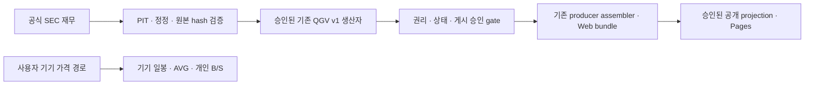

# 일일 데이터 파이프라인 설계

상태: **DESIGN / IMPLEMENTATION_NOT_APPROVED**. 조사일: **2026-10-09 UTC**.
기준: canonical `3f3eb3f8ba1dacb2cfebfe2ac0a83ab5d42c6dbc` (#76 병합).
작업 브랜치: `docs/daily-data-pipeline-design`. 이번 변경은 문서만이며 예약 실행,
공급자 채택, 키 발급, 수집, 공개 데이터 교체를 승인하거나 실행하지 않는다.

## 1. 문제와 경계

공개 앱의 기본 종목군은 `FROZEN_SNAPSHOT / 2024-12-31`이다. 현재 데이터를
매일 받는 경로가 없지만, 수집만 추가해 모든 `NOT_AVAILABLE`을 해소할 수는 없다.
가격 권리, PIT 시각, 실제 분석 엔진, 생산자 형태 호환성, 검증·게시 승인이 각각 필요하다.
기존 Frozen 자료는 재작성하지 않고 새 관측을 별도 버전으로 남긴다.

현행 [GSQ-001](../pages_cockpit_owner/GOOGLE_SHEET_QUOTES_DECISION_REGISTER.md)은
Google → 사용자 기기 직접 읽기만 허용하고 서버·중계·Actions 시세 수집을 금지한다.
Alpha Vantage OFF, KIS·중계 DEFERRED, 수동 입력과 Google 시트 기본 OFF를 유지한다.
아래 Actions 설계는 향후 승인된 공개 재무 생산자의 실행 위치 제안이다. 가격을
Actions로 받거나 원시 가격을 공개하는 선택은 별도 사용자 결정과 append-only
26E 후속 기록이 필요하다. Google 시트·기기 개인 데이터를 Actions로 가져오는 경로는 없다.

방법론·점수식·가중치·TARGET·Holdout 선택/사용·주문 기능을 변경하지 않는다.
운영 모드는 `READ_ONLY`이며 이번 문서 PR 병합도 사용자 승인 대기다.

## 2. 기존 연결점과 실제 막힌 곳

| 연결점 | 재사용 범위 / 현재 한계 |
|---|---|
| `providers/sec_companyfacts.py`, `sec_submissions.py`, `sec_vintage.py`, `sec_accn_reconcile.py`, `sec_cover_shares.py` | SEC 해석·accession 대조·시점별 사실 선택 재사용. 날짜의 UTC 자정 변환을 실제 공시 공개 시각으로 인정하지 않음. |
| `universe/sources.py`, `contracts/universe.py` | 승인된 **US Market-Cap Top 500 PIT** 및 `official_mcap500_snapshot` 재사용. S&P 500은 대체 종목군이 아님. 후보 풀 완전성은 별도 증명 대상. |
| `qgv/scoring_standard.py`, `raw_map.py`, `pipeline.py`, `leaderboard.py` | **STANDARD v1 · UNCALIBRATED** 그대로. 점수 기준 버전과 엔진/계약 버전을 별도 기록. 기존 `us_live.py`의 Yahoo 비공식 가격 경로는 운영 출처로 채택하지 않음. |
| `providers/fred_alfred.py`, `fred_csv.py`, `macro/engine.py`, `versions.py` | 기존 입력 해석을 검토 대상으로 재사용. CSV는 현재 수정 빈티지이며 엄격 PIT fallback으로 쓸 수 없음. FRED 권리와 8축 생산자 연결은 미완료. |
| `producers/contract.py`, `freshness.py`, `adapters.py`, `assembler.py` | `PRODUCER_SNAPSHOT v1` → `PRODUCER_BUNDLE v1` → `web_mvp` schema 1. 점수 재계산은 생산자에서만 수행. Macro adapter는 현재 형태 불일치로 차단. |
| `tools/build_pages_cockpit.py`, `pages_artifact_guard.py` | 현재 공개 빌드는 `repository_bundle()`만 사용하고 시총 값을 제거하며 공개 파일 해시를 고정한다. 외부 bundle의 자동 공개 경로는 아직 없음. |

형태가 호환돼도 연구·잠정 상태나 synthetic 결과를 `LIVE`로 승격하지 않는다.
생산자 기본 registry의 QGV 연구 전용, 기술 실제 모델 없음, Macro 형태 불일치와
리더보드 상위 QGV 없음 사유는 데이터 수집과 별개로 남긴다.

## 3. D1~D6 출처·권리·주기·형식·실패 처리

### D1 — 현재 미국 시총 상위 500

**조건부 가능**: 전체 적격 후보 풀, PIT 주식 수, EOD 가격과 순위 공개 권리 필요.
전체 기업·리더보드의 종목군을 공급하며 기존 2024-12-31 목록을 오늘 목록으로 재표시하지 않는다.

- 출처: SEC submissions의 CIK·ticker·거래소 식별을 보조 자료로 사용하고,
  권리 확인된 공급자의 미국 상장 security master·상장/폐지·클래스 이력과 대조한다.
  SEC ticker 목록이나 기존 500개만으로 전체 적격 풀의 완전성을 증명하지 않는다.
  기존 gate의 적격 기준은 `as_of`의 최신 정기 공시가 10-K/10-Q인 **미국 국내
  filer**다. 20-F/40-F foreign filer/ADR은 기존 정책대로 제외하고 UNKNOWN은
  명시한다. 복수 클래스·거래소·기업 단위 묶음은 기존 Track A 정책을 적용한다.
  다른 지역/ADR을 포함하도록 종목군을 넓히지 않는다. D4의 미국 거래라인
  17개와 D1의 국내 filer 적격성은 별개다.
- 구성: 기존 승인 방식의 `as_of` 이전 공개 주식 수 × 해당 시점 가격을 사용한다.
  기업 전체 주식 수와 특정 클래스 가격/ADR 비율의 혼합은 금지한다. 가격은
  [가격 옵션](PRICE_RIGHTS_OPTIONS.md)의 사용자 선택 후만 사용한다. 순위도 파생값 공개 권리를 확인한다.
- 주기: 거래일 EOD 완료 후 일 1회 평가; 신규 상장·폐지·split·ticker 변경은
  별도 유효일/공개일을 기록한다. 주식 수는 매일 실측한 수치가 아니라 최신 **공개** 사실이다.
  휴장일에는 마지막 세션과 자료 기준일을 유지한다.
- 형식: 기존 `UniverseSnapshot`·`company_id`·CIK·security reference·membership
  lineage·source vintage·포함/제외 커버리지. 시총 순위와 QGV 순위를 구별한다.
- 실패: 미해결 식별/누락 가격·주식 수/불완전 풀은 0으로 채우지 않는다.
  부분 후보 순위를 “현재 미국 전체 상위 500”으로 발표하지 않는다. 검증 실패 시
  기존 Frozen 종목군을 명시적으로 유지하고 현재 종목군은 `NOT_AVAILABLE`로 보고한다.

### D2 — SEC 재무·공시 / L03 재무 추이 / L06 주주환원

**가능, 운영 전 PIT 보완 필요**: 공개 JSON 재사용의 공식 근거가 있고 공급자 코드가 존재한다.

- 출처/권리: SEC `data.sec.gov` companyfacts·submissions JSON. SEC 공식 FAQ와
  Privacy Information은 공개 정보 접근·재사용·배포를 허용한다. 출처·CIK·accession·
  taxonomy·concept·단위·기간을 포함한 사실 JSON을 기본 공개 후보로 한다.
  첨부 원문·이미지·개인정보를 통째로 재게시하는 설계가 아니다. companyfacts는
  표준 taxonomy·entity-level 중심이며 custom/segment 누락을 추정하지 않는다.
  `data.sec.gov`는 브라우저 CORS를 지원하지 않으므로 SEC를 앱에서 직접 조회하는
  신규 경로를 가정하지 않는다. [SEC-1~4](#9-공식-출처와-조회일)
- 주기: 일 1회 새 공시/정정 감지 후 변경 issuer만 companyfacts 갱신. 최초 적재는
  승인된 작은 범위에서 시작하고 예산·fair access를 확인한 뒤 확대한다. 기업 재무
  관측 기간은 분기/연간이므로 “매일 새 실적”이라고 표시하지 않는다.
- PIT: 회계 기간 종료일, `filingDate`, acceptance time, 최초 공개/이용 가능 시각,
  취득 시각을 분리한다. 현행 `sec_submissions`/`sec_vintage`의 `filed` UTC 자정은
  실제 intraday 공개 시각이 아니다. SEC의 일부 늦은 제출·다음 영업일 공개와
  사후 정정도 고려한다. 정확 시각이 없으면 당일 자정으로 추정하지 않고,
  증명 가능한 보수적 이용 가능 시각 이전 요청은 제외하거나 `NOT_AVAILABLE`로 둔다.
  companyfacts parser의 published/available/observed도 현재 filed에서 파생되고
  accession 대조는 `full_pit_pass=False`이므로 별도 시각 증거 없이 PIT PASS로 올리지 않는다.
- 정정: 원 accession/값은 불변 보존하고 정정 accession·공개 시각·대체 관계를
  별도로 기록한다. 당시 `available_at <= as_of`인 vintage만 선택한다. 오늘 수정된
  companyfacts로 과거 snapshot을 덮어쓰지 않는다. 새 수집을 과거 빈티지 확보로 해석하지 않는다.
- 형식: RawDatasetStore 입력 manifest/hash → 기존 parser → RawFundamentals/기간별
  사실. 분기 단독/누적·연간/TTM·연결 범위·통화·duration·기업별 taxonomy를 대조한다.
  L03 ROIC/성장률과 L06 배당/매입은 기존 정의와 비교 가능한 원재료가 있을 때만 제공한다.
- 실패: HTTP 403/429/5xx·timeout·schema/단위 변화·accession 불일치·중복/모호한
  사실은 issuer별 실패로 격리한다. 제한된 재시도 후 이전 검증 값을 유지하되 기준일을
  바꾸지 않는다. 없는 EPS/FCF/주주환원 항목은 결측이지 0이 아니다.

### D3 — QGV 스냅샷과 리더보드

**조건부 가능**: D2 + 가격/파생값 권리 + 기존 생산자·게시 gate 충족 필요.

- 입력/권리: 같은 cutoff의 승인된 D1 membership, D2 사실과 권리 확인된 가격·
  필요한 기존 근거만 사용한다. SEC 기반 계산 결과라도 가격이 섞이면 해당 파생값
  공개권리를 별도로 확인한다. Q/G/V 결측과 부분 커버리지를 공개하며 평균값·추정값을 만들지 않는다.
- 계산: `scoring_standard.py`의 **v1 / UNCALIBRATED**를 유지한다. 엔진 버전,
  factor/단위·원재료 hash, 실제 계산 기준일을 별도 보존한다. 보정·calibration·
  신방법론·Holdout을 사용하지 않는다. 기존 결과를 재계산/재라벨해서 검증 완료로 만들지 않는다.
- 주기 제약: 일 1회 **새 입력 여부와 신선도 평가**를 먼저 한다. 현행
  `universe/events.py`는 FUNDAMENTAL → QGV, PRICE → Technical만 dirty로 만든다.
  V는 가격에 의존하므로 “가격만 바뀌어도 V를 매일 재계산”하는 정책은 기존 동작과
  다르다. 이 PR은 해당 정책을 변경하지 않는다. 후속 owner 결정 전에는 기존 계산
  결과의 `as_of`를 유지하며 오늘의 V/전체 QGV라고 표시하지 않는다.
- 형식: 기존 QGVSnapshot/LeaderboardSnapshot + 생산자 provenance. 기존 snapshot
  식별자는 보존하고, 일일 산출물은 company/section·cutoff·producer/methodology
  버전·입력 hash·canonical SHA-256으로 구별하는 불변 manifest를 제안한다.
  리더보드는 같은 승인 QGV 스냅샷을 소비하고 QGV를 다시 계산하지 않는다.
- 실패/게시: 입력 부족·버전 혼합·synthetic·연구 상태·validation 비PASS 또는 게시
  근거 없음이면 `NOT_AVAILABLE`. 오래된 결과의 기준일을 실행일로 바꾸지 않는다.
  관심 기업은 같은 공개 snapshot을 참조하되 관심 목록 자체는 기기에만 둔다.
  모델 포트폴리오는 해당 owner의 기존 계약/게시 gate가 충족되기 전 준비 중이다.

### D4 — 승인 19종목 과거 일봉 / 기술·이벤트 차트

**조건부 가능**: 17 미국 + KRX:042700 + Tokyo Electron 8035의 지원과 가격 권리 선택 필요.

- 출처/권리: 옵션 1 기기 직접 조회 또는 옵션 2 명시적 라이선스 경로를 사용자에게
  비교 제시한다. Yahoo 비공식 API·스크래핑을 운영 출처로 선택하지 않는다.
  GOOGLEFINANCE의 API 경로로 과거 일봉을 얻는다고 가정하지 않으며 현재 TYO:8035
  `#N/A` 상태를 다른 ticker 추측으로 해결하지 않는다.
- **Tiingo 추가 선택지:** 기존 워크플로의 정확한 Secret 이름은 `TIINGO_API_KEY`다.
  존재는 사용자 확인, 실제 계정 플랜·잔여 한도·적용 약관/추가 계약은 미확인이다.
  공개목록의 미국 17종목은 내부 사용 후보이나 TSE 8035·KRX 042700 본상장은 없다.
  무료 Starter의 비휘발성 저장과 별도 계약 없는 공개 Pages 가격 JSON은 공개 최신
  조건상 불가다. [가격표·한도·지원목록·약관 원문](PRICE_RIGHTS_OPTIONS.md#tiingo)을 따른다.
- 주기/형식: 최초 과거 이력의 승인된 기간과 이후 완료 세션 증분을 구별한다.
  canonical security mapping, 거래소/시간대, 세션 일자, OHLCV, 통화,
  가격 basis(조정/비조정), split/dividend의 유효·공개 시각, 공급자 vintage를 기록한다.
  세 시장의 마지막 세션은 서로 다를 수 있다. 거래일과 달력일을 혼동하지 않는다.
- PIT/표시: 미래 split·배당을 반영해 재작성된 adjusted series는 그 사실과 조정
  vintage를 표시하고 당시 알고 있던 가격처럼 재생하지 않는다. AVG와 차트는 동일
  통화·security·가격 basis일 때만 겹쳐 표시한다. basis 검증 실패 시 AVG를 보류한다.
- 실패: 누락 세션·불완전 일봉·중복·잘못된 통화/매핑·권리 또는 호출 한도 실패 시
  기존 bar를 보존하고 누락을 표시한다. 0·직선 보간·DEMO 대체로 채우지 않는다.
  일봉이 생겨도 synthetic 기술 엔진을 실제 분석으로 승격하지 않는다.
- 개인 표시: [차트 목록의 요구 1개](../../experiments/chart-contract-v0.1/CHART_INVENTORY.md#개인-표시-요구-1개-문서-요구-추가)를
  참조한다. AVG는 이미 기기에 저장된 `average_cost`의 표시만 하며 개인 원본은
  공개하지 않는다. 후속 B/S 마커 입력 방식은 사용자 결정 사항이다. 기업 재평가
  코드는 R(Re-rating), 내 매수 B/내 매도 S는 기기 전용이다.

### D5 — 매크로 8축 입력

**조건부 가능 / FRED 운영 경로 INACTIVE**: 권리·PIT·Stage 3·형태/게시 gate가 남아 있다.

- 출처: 기존 FRED/ALFRED 후보를 검토하되 현재 CSV 임시 5개 시리즈만으로
  8축을 완성했다고 주장하지 않는다. 축은 **Growth / Inflation / Liquidity /
  Monetary Policy / Credit / Labor / Fiscal / FX**, 각 **Level / Direction /
  Momentum / Surprise / Stress / Confidence**이며 단일 종합 점수를 만들지 않는다.
- 버전: 현행 엔진 **v0.1.1 확정**, **v0.1.4-CANDIDATE**는 후보다.
  후보 기록의 Stage 3 실데이터/PIT·Stage 4 통합 진행과 정합시키며 데이터 공급
  계획으로 후보 계산·8축 모델을 승격하지 않는다. [기존 Macro 후보 기록](../../../Macro%20System%20%C2%B7%20Latest%20Consolidated%20Record%20v0.1.4%20Candidate.md)의
  2026-09-22 Stage 2/6 완료·Stage 3/4 진행·오프라인 PASS는 운영 데이터 연결 완료가 아니다.
- 권리: 2026-10-09 FRED Legal의 API 추가 금지 (k)/(l)는 소프트웨어 프로그램·
  시스템·ML/AI 개발/훈련 관련 접근 및 저장·cache·archive·database·제3자 제공
  제한을 명시한다. 별도 API Terms
  페이지에도 Website Legal이 적용된다. 무료 API나 series public-domain 표기만으로
  이번 저장·공개 파이프라인을 허가받았다고 해석하지 않는다. [FRED-1~2](#9-공식-출처와-조회일)
  시리즈별 원 제공자 권리와 저장·변환·재배포·AI 활용 허용을 공식 확인할 때까지
  FRED 원본 archive·운영 수집·파생 JSON 공개를 활성화하지 않는다. ICE credit
  후보처럼 pre-approval이 필요한 시리즈는 별도 조건을 둔다.
- 대안: BLS/BEA의 직접 공식 원재료는 해당 기관의 공개 재사용 근거가 있으므로
  별도 후보로 검토할 수 있다. 동일 지표인지·빈티지/발표 시각·나머지 8축 커버리지를
  확인하고 owner 승인을 거쳐야 하며 이 PR이 공급자나 지표를 교체하지 않는다.
- 주기/PIT: 일 1회 **발표·수정 확인**, 실제 관측은 일/주/월/분기 원 주기를 유지한다.
  observation date, 원 발표일/시각, FRED 이용 가능일, realtime/vintage 기간과
  acquired_at을 분리한다. ALFRED 일 단위 vintage는 intraday 발표 시각의 증거가 아니다.
  해석 불가 시 보수적 사용 시각 또는 결측을 기록한다. ALFRED 실패 후 최신 CSV로
  fallback하는 현행 경로를 엄격 PIT 산출물로 통과시키지 않는다.
- 형식/실패: source series·unit/frequency·vintage·revision lineage와 기존 Macro
  snapshot을 결합하는 후보 계약을 검토한다. 8축 계산 미완성·권리 미확인·발표일
  모호함·현재 adapter `environment.indicators`/`exposures` 불일치 시 각각 명시적
  `NOT_AVAILABLE`. 현재 8×6칸은 근거 없이 채우지 않는다.

### D6 — 한미반도체·도쿄일렉트론 재무

**조건부 가능, 미구현**. DART·EDINET은 중복 조사하지 않고 별도
[PR #77](https://github.com/kco994553-star/Investment-System1/pull/77)의
[고정 연구 문서](https://github.com/kco994553-star/Investment-System1/blob/7213dbaaf0154afd5d35f0913f31a3693f69b1b6/implementation/docs/fundamentals_sources/KR_JP_FILINGS_RESEARCH.md)를 연결한다.
조회 2026-10-09: #77은 **OPEN / 미병합**, head `7213dbaaf0154afd5d35f0913f31a3693f69b1b6`.
이 링크는 채택·키·무료 entitlement·CI·병합 승인을 대신하지 않는다.

- **키 준비 상태:** `DART_API_KEY`는 아직 Secret 미등록(사용자 확인).
  OpenDART 점검 종료 예정 **2026-10-11 18:00 이후**, 사용자가 이 이름으로 등록할 예정이다.
  [공식 점검 공지](https://opendart.fss.or.kr/)의 기간은 2026-10-08 20:00~2026-10-11 18:00이며
  시간대는 명시되지 않았다. 키 신청/관리·고유번호·공시 원문·XBRL 등이 일부 중단
  대상이고 숫자 재무제표 API 전체 중단을 뜻하지 않는다. 실제 재개와 사용자 등록을 확인한다.
- **D6 첫 구현 대상:** **한미반도체(KRX 042700) 숫자 재무제표 JSON**.
  `corp_code=00161383`의 숫자 계정 API를 검토한다. 연결/별도·기간·통화·접수번호를
  보존하며 주석 원문은 별도 권리 확인 대상으로 둔다. 키 등록·서비스 재개·별도 구현
  승인 이후 진행하고 등록 전 인증 호출·예약 작업을 시작하지 않는다.
- **Secret 보호:** `DART_API_KEY`·`TIINGO_API_KEY`의 이름·존재 여부만 기록한다.
  값은 코드·로그·커밋·PR·공개 산출물에 출력하지 않으며 이번 조사에서 조회하지 않았다.
- 출처/권리: 연구 PR의 숫자 가공 JSON 공개 조건과 원문/제3자 권리 gate를 따른다.
  DART 키 위탁·IP/hosted runner 조건과 EDINET 인증/한도는 조사 PR의 미확인 범위를 유지한다.
- 주기: 해당 시장 영업일의 신규·정정 공시 일 1회 확인을 제안하며 구현 승인 전 실행하지 않는다.
- 형식: 기업 ID/시장별 공시 ID·제출/정정 관계·공개 시각·연결/별도·분기/누적·
  회계연도·통화/단위·taxonomy를 canonical facts/provenance로 연결하는 후속 계약.
- 실패: 자료·동의·키·PIT·재무 기준 또는 공개 권리 부족이면 결측/기존 값 보존.
  SEC endpoint의 URL만 바꾸거나 미국 단위/분기 규칙을 그대로 적용하지 않는다.

## 4. 공통 레코드와 Web 계약

모든 원재료와 결과는 출처·자료 기준일·`as_of`·PIT 이용 가능 근거를 연결 가능하게
가진다. 아래는 설계 요구이며 이번 PR에서 JSON 필드를 추가하지 않는다.

| 정보 | 기존 계약에 연결하는 방식 |
|---|---|
| 데이터 상태 | `data_state`/Web `state`: LIVE, FROZEN_SNAPSHOT, DEMO, NOT_AVAILABLE. 실행 성공과 LIVE는 다름. |
| 신선도 | 기존 `freshness.classify`: FRESH / STALE / NOT_USABLE. **기존 NOT_APPLICABLE도 보존**: Frozen·DEMO·NOT_AVAILABLE에 FRESH를 만들어 붙이지 않음. |
| 자료 시점과 작업 시점 | 관측/기간 기준일·vintage·`available_at`은 원재료에, `requested_as_of`, 실제 `as_of`, `generated_at`은 생산자에. 취득/실행 시각을 자료 시점으로 대체하지 않음. |
| 출처·무결성 | `provenance.source/inputs`, artifact ID·SHA-256, source vintage. 입력 blob을 재검증할 수 있어야 함. |
| 결과 버전 | 기존 snapshot ID, producer ID/version, methodology ID/version/status, validation, data/snapshot hash. 일일 manifest가 결과를 결속. |
| 만료 | LIVE에는 producer 선언 `expires_at`; 필요 시 `usable_until`. 휴일·발표 주기/공급자 완료 지연을 owner가 정하며 새 TTL을 UI에서 추정하지 않음. |
| 결측과 범위 | 실제 결측 사유·포함/제외 coverage·범위 및 entity IDs. null/없음 ≠ 0. 식별 미확정과 수치 누락을 구별. |

각 행/사실이 section metadata를 상속할 때는 정확한 부모 입력/manifest 참조를
가지고, 행 고유 기간·공개 시각은 원재료에 남긴다. section 최신 시각으로 오래된
개별 행을 갱신하지 않는다. 필요 계약 확장은 후속 구현 PR에서 기존 shape/hash
검증과 함께 검토하며 adapter가 임의 reshape·재점수화하지 않는다.

FRESH는 LIVE의 만료 전 상태이지 과거 재무 기간이 오늘이라는 뜻이 아니다.
실패 시 이전 payload와 `as_of`/`generated_at`/입력 hash는 그대로 보존한다.
그 위에 원 만료 시각에 따른 신선도와 마지막 시도·실패 사유를 표시한다.
만료 전 기존 자료는 FRESH일 수 있지만 실패한 재시도를 신규 성공으로 보지 않는다.
만료 후 STALE/NOT_USABLE을 적용하며 성공 시각/expiry를 연장해 새 값처럼
보이지 않게 한다. NOT_USABLE 결과는 기존
assembler가 `NOT_AVAILABLE / EXPIRED_NOT_USABLE`로 보류한다.

## 5. 실행·저장·배포 설계

가격·FRED 권리 미확인 입력은 위 공개 계산/배포 경로에 넣지 않는다. 기기 개인
자료는 왼쪽 공개 파이프라인에 역으로 전송하지 않는다. 기술·Macro·모델 포트폴리오는
각 owner의 생산자·게시 승인 전까지 상태 화면을 유지한다.

### GitHub Actions 운영 후보

- 실행 위치는 공개 저장소 **standard GitHub-hosted runner**. 공식 과금 문서상
  해당 runner는 무료지만 larger runner·artifact/cache 저장 한도는 별도다.
  “모든 저장소/runner/저장 공간이 무제한 무료”로 가정하지 않는다. [GH-1~2](#9-공식-출처와-조회일)
- 설계상 기본은 일 1회 EOD 완료 후이며 정각 혼잡을 피한 예시 시각 **07:17 UTC**.
  시장별 완료·휴장과 원 발표 시각을 따로 검사하며 이것은 워크플로/cron 추가가 아니다.
  SEC 공시 감지는 일일 index/변경 목록을 이용하는 후속 설계 후보다.
- `schedule`은 지연되거나 누락될 수 있고 SLA가 없다. default branch에 있는
  workflow만 default branch에서 실행한다. 조사 시 default=canonical이지만
  변경되면 사전 점검 후 중단하며 기본 브랜치·ruleset을 자동 변경하지 않는다.
- 공개 저장소 **60일 무활동** 시 예약이 비활성화될 수 있다. 기록된 마지막 성공,
  예정 실행 대비 지연·누락·신선도를 사람이 확인하고, 사용자가 Actions에서 다시
  활성화한 뒤 승인된 manual dispatch로 누락 구간을 복구하는 절차를 설계한다.
  keep-alive 커밋·자동 권한 변경·무단 알림 발송은 사용하지 않는다.
- 호출은 제공자별 한도 이하로 직렬/제한 병렬, timeout·backoff·재시도 상한·요청
  예산을 둔다. SEC는 공식 최대 10 requests/s보다 낮은 계획으로 시작하고 실제
  운영 연락 가능한 User-Agent를 사용한다. 기존 placeholder 연락처는 운영 전에 교체 검토한다.
- 수집 job의 기본 권한은 read. 공개 deployment 권한은 검증된 산출물 배포 job에만
  기존 범위로 둔다. 주기별 임의 코드 merge·canonical 자동 push·force push를 하지 않는다.
  비밀 키가 승인될 경우 provider 조건에 맞는 서버 credential만 별도 안전 관리하며
  개인 Sheets ID/Google 토큰/기기 키를 Actions secrets로 복사하는 설계는 금지한다.

### 저장과 공개의 분리

- 권리가 확인된 원본은 hash·취득 receipt와 함께 불변 보존한다. 원본 저장 위치와
  기간도 권리 범위다. `RawDatasetStore`/persistence audit을 재사용하고 삭제되는
  cache·기간 만료 artifact를 유일한 PIT 원본 저장소로 삼지 않는다.
- MVP 공개 후보는 허용된 SEC 숫자 사실·출처·검증 receipt. 가격/FRED 원본 및
  권리 미확인 파생값은 Git history·PR 첨부·Actions log/artifact·Release·Pages
  어느 공개 경로에도 넣지 않는다. 공급자 비밀을 URL/log/hash 원문에 포함하지 않는다.
- 권리가 허용되는 저장소와 예산이 정해지기 전에는 실제 운영 적재를 시작하지 않는다.
  공개 가능한 SEC 원본만 durable 위치 후보로 평가하며, 외부 storage 신규 도입은 별도 승인이다.
- generation 단위 입력·snapshot·bundle·manifest hash를 검증한 후 전체 새 Pages
  artifact를 배포한다. 기존 `write_bundle_atomic`은 bundle와 sidecar를 각각 교체하므로
  파일 묶음 전체의 원자성까지 보장한다고 가정하지 않는다. 후속 구현은 generation
  참조/전체 artifact로 서로 다른 날짜의 파일 혼합을 차단한다.
- 현재 공개 guard는 정확한 16파일 hash를 고정하고 builder는 Frozen만 내보낸다.
  향후 데이터 갱신을 위해 **검토된 schema/provenance/public projection 및 새로운
  정상 데이터 허용 규칙**을 먼저 승인받는다. guard 제거·무검증 최신파일 덮어쓰기는 금지한다.
  공개 산출물 실패 시 이전 검증 배포를 유지하고 원 기준일/만료가 공개본에 남게 한다.

## 6. 최소 단계와 승인 기준

| 단계 | 최소 결과 | 다음 단계 진입 조건 |
|---|---|---|
| M0 — 현재 문서 | D1~D6·가격 옵션·L05/개인 표시 요구 | 문서 PR 병합 승인. 수집/구현 승인이 아님. |
| M1 — SEC 입력/PIT 기반 | 소수 승인 issuer의 기존 provider 재사용 후보, 정확한 available_at·정정 lineage·결측·저장 receipt. QGV에 필요한 입력 커버리지만 보고 | 별도 구현 승인, SEC 접근 예산/연락처·원본 보존·PIT 테스트. 실제 QGV/Pages 자동 게시 없음. |
| M2 — D2 + D3 생산 후보 | v1 보정 전 계산·리더보드 소비 계약을 검증; 부족 입력은 그대로 결측 | 가격/파생 공개 권리, PRICE→V 갱신 정책에 대한 owner 결정, 비synthetic·producer 검증·게시 승인. 가격 없으면 완전한 일일 V/QGV/리더보드 불가. |
| M3 — D1 현재 종목군/일일 공개 | 현재 전체 적격 풀·PIT 시총 순위·daily bundle 후보 | 후보 풀 완전성·identity/corporate actions·계약·동적 산출물 guard·운영 및 배포 승인. 기존 Frozen 공개 fallback 유지. |
| M4 — D4 차트/기기 AVG | 권리 확인된 19종목 일봉과 기기 전용 AVG 표시 후보 | 3시장 symbol/통화/basis·이력 기간·CORS 또는 정적 파일 재배포 계약. 기술 실제 엔진/개인 B/S 입력은 각각 별도 후속 승인. |
| M5 — D5/D6 | Stage 3·PR #77 결과와 연계한 입력 producer 후보 | FRED/원기관·시리즈별 권리, PIT·8축 owner/adapter·게시 승인, D6 연구 PR 및 시장별 인증/계약 승인. |

각 구현 PR의 모의 검증에는 당일/정정 시각 전후·늦은 공개·휴장/다른 세션·
429·부분 실패·입력 hash 불일치·누락값·연구/synthetic·expiry·기기 개인값 유출을
포함한다. 초기·확대 운영 범위는 별도 승인하며 테스트/CI에서 실제 Google 또는
무단 실제 대량 호출을 하지 않는다.

## 7. 사용자 결정이 필요한 항목

1. 가격 옵션: 목적상 옵션 2의 **정적 공개 파일/파생값 재배포를 명시 승인하는
   라이선스**를 조건부 추천한다. 공급자·3시장 coverage·예산·보존/다운로드 범위는
   아직 미확정이다. 비용을 쓰지 않으면 옵션 1의 부분 기기 차트와 Frozen 공개
   종목군을 유지하는 대안이며, 전체 현재 500/완전 일일 V를 제공한다고 약속할 수 없다.
2. 해당 가격 선택이 Actions 시세 수집·공개에 영향을 주면 기존 26E에 append-only
   후속 결정을 남긴다. 추천/문서 병합만으로 현행 금지를 해제하지 않는다.
3. D3 가격 변경 시 V 재계산의 owner 정책·기존 연구/게시 상태와 실제 LIVE 승격
   조건, producer가 선언할 expiry/usable_until 및 실행/원본 보존 예산.
4. D5 FRED 저장·공개·AI 범위의 공식 허가 확인 또는 권리 확인된 원기관 후보
   조사, Stage 3/8축·Macro shape 정합. 모델 버전 승격은 이번 설계 범위 밖이다.
5. 후속 개인 B/S 입력: 비공개 Sheets `Trades` 읽기 전용 재사용 / 앱 직접 입력.
   지금은 요구만 기록한다. D6는 미병합 연구 #77과 별도 구현 승인 경계를 유지한다.

## 8. 첫 구현 PR 제안 — 실행하지 않음

**“SEC 일일 입력의 PIT 시각·정정 lineage 및 보존 receipt 보완”**: M1의 작은
issuer 범위와 기존 provider를 대상으로 exact/보수적 available_at·정정/재실행
검증·결측/실패 보존을 구현하는 별도 PR을 제안한다. 가격 수집·QGV 재점수 정책·
예약 워크플로·Pages 데이터 자동 공개를 이 첫 PR에 묶지 않는다. 이후 승인을
받아 주기 실행을 연결한다. 이번 작업에서는 해당 구현을 시작하지 않는다.

## 9. 공식 출처와 조회일

아래 공식 문서는 모두 **2026-10-09 UTC**에 확인했다. 실제 재무/가격/매크로
대량 수집은 하지 않았으며 권리 판단은 인용 문서의 적용 범위 내 조건부 설계다.

| ID | 공식 URL | 설계에 반영한 근거 |
|---|---|---|
| SEC-1 | https://www.sec.gov/search-filings/edgar-search-assistance/accessing-edgar-data | REST JSON·fair access·10 requests/s·일별 공개/index와 사후 정정. |
| SEC-2 | https://www.sec.gov/about/webmaster-frequently-asked-questions | 정부 작성/EDGAR 공개 filing의 접근·재사용과 acceptance time 설명. |
| SEC-3 | https://www.sec.gov/about/privacy-information | 공개 정보 복사·배포와 접근 제한. |
| SEC-4 | https://www.sec.gov/search-filings/edgar-application-programming-interfaces | 무키 JSON·history 추가 페이지·표준 entity facts·CORS 미지원. |
| FRED-1 | https://fred.stlouisfed.org/legal/ | 서비스/API 추가 조건, 권리 유형·저장/AI 제약·면책 표시. |
| FRED-2 | https://fred.stlouisfed.org/docs/api/terms_of_use.html | Website Legal 포함. 페이지 차이가 추가 허가가 아님. |
| FRED-3 | https://fred.stlouisfed.org/docs/api/fred/realtime_period.html | 날짜 단위 real-time period. |
| FRED-4 | https://fred.stlouisfed.org/docs/api/fred/series_vintagedates.html | 신규/수정 vintage; 값이 바뀌지 않은 발표와 구별. |
| FRED-5 | https://fred.stlouisfed.org/docs/api/fred/release_dates.html | 원 발표일과 서비스 이용 가능일 차이. |
| FRED-6 | https://alfred.stlouisfed.org/help | 원 발표·최초 이용 가능 시점과 ALFRED 반영. |
| FRED-7 | https://fred.stlouisfed.org/docs/api/api_key.html | 앱·사용자 키 조건; 이번 키 발급 없음. |
| FRED-8 | https://alfred.stlouisfed.org/series?seid=BAMLH0A0HYM2 | ICE credit 후보 권리/사전 승인. 시리즈 자료 수집은 하지 않음. |
| PRIMARY-1 | https://www.bls.gov/bls/linksite.htm | BLS 원 작성 정보 재사용, 이미지 예외. 원기관 후보 조사 근거. |
| PRIMARY-2 | https://www.bea.gov/help/faq/147 | 달리 명시된 예외를 제외한 BEA 정보 재사용. |
| GH-1 | https://docs.github.com/en/actions/reference/workflows-and-actions/events-that-trigger-workflows#schedule | 예약 지연/누락·default branch·60일 무활동. |
| GH-2 | https://docs.github.com/en/billing/concepts/product-billing/github-actions | 공개 standard runner 무료와 별도 저장/runner 비용 경계. |

가격 출처/권리의 URL·비용·미확인 항목은 [PRICE_RIGHTS_OPTIONS.md](PRICE_RIGHTS_OPTIONS.md)에,
D6 출처 확인은 위 미병합 #77 고정 문서에 위임한다.
