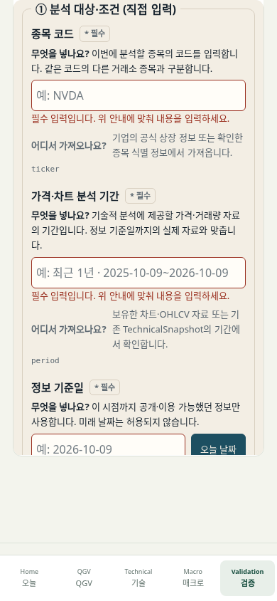

# 프롬프트 입력 안내 검증 기록

작업 브랜치: `codex/prompt-field-guide`.
확인한 canonical은 `c8b9debecaeaebf392672c74f5bfd50b20217227`입니다.
요청한 기준인 “#75 병합 이후”는 아직 적용할 수 없습니다. #75는 OPEN이며,
병합 승인 또는 현재 canonical 사용 결정 전에는 이 작업의 PR을 생성하지 않습니다.
이 기록은 로컬 검증이며 GitHub CI 통과를 주장하지 않습니다.

## 화면과 입력

- Frozen 본문 70개를 대조해 34개 변수에 한국어·영어 이름, 설명, placeholder,
  자료 위치를 추가했습니다. 직접 입력과 시스템 결과를 나누고 원래 변수명도 표시합니다.
- `input_mode`는 기존 두 선택지만 유지합니다. KST 오늘 날짜 버튼은 클릭할 때
  `as_of`만 채우며, 필수 누락과 기존 형식 오류는 입력칸 아래에 표시합니다.
- 공개 자료 가져오기는 명시적인 클릭으로만 작동합니다. 공개 QGV·리더보드·기술·거시
  자료의 허용 필드와 출처·기준일·데이터 상태를 전달하며 개인 저장소를 읽지 않습니다.
- 현재 공개본에는 해당 분석 자료가 없어 가져오기 버튼 대신 자료 없음 안내가 나옵니다.
  가용 자료 경로는 브라우저 메모리의 모의 응답으로 검증했습니다.
- 통합 판단·커버리지·참조 3개 변수의 실제 공개 계약은 없습니다. 개별 QGV 범위나
  임의 Snapshot ID를 조합하지 않고 미가용으로 표시합니다.

변수 의미와 초안에서 보완한 설명은 [VARIABLE_MEANINGS.md](VARIABLE_MEANINGS.md)에 있습니다.

## 결과

- 전체 Python: 860개 + 345 subtests PASS. 기존 채우기·검증 테스트 포함.
- 신규 안내 브라우저: 16,833 checks PASS, 390/1280px × ko/en.
- 기존 Node 장치·Google 모의 테스트: 84개 PASS; 언어 검색: 26개 PASS.
- 기존 브라우저: Pages 10, 실제 보유 40, 수동 시세 119, Google 모의 40,
  Google 저장소 13, 상태 표시 31, 리서치 가드 10, Web MVP 10, 전역 언어 8 PASS.
- 예시 미입력, KST 날짜, 언어 전환 시 값·원본 보존, 수동 가져오기 및 정확한 preview,
  같은 티커의 전체 기업 목록 2건/분석 행 1건 차단을 검증했습니다.
- 개인정보 필드·중첩 근거·메타데이터와 코드 별칭·비유한 숫자 제외,
  잘못된 origin/source 메시지 무시, 가져오기 중 개인 저장소·DB·네트워크 접근 0을 확인했습니다.
- Frozen SHA:
  `f0a6ed9005e22b8fa534d51135cc3e734aa9577150438a35d65823a4c283e68e` 유지.
  본문·변수명·필수 여부·종류·owner와 기존 JS validator의 SHA도 유지했습니다.
- 공개 파일 16개 중 `app.js`, `locale.js`, `research.html`만 변경했습니다.
  공개 JSON 3개와 `index.html`의 CSP·외부 스크립트 목록은 byte 단위 동일합니다.
- 공개 산출물 가드 PASS. 신규 브라우저에서 외부 호출·CSP 위반·실패 응답·런타임 오류 0.
  기존 Google 테스트의 요청은 모두 모의 응답이며 실제 로그인·Sheets 호출은 없습니다.

[결과 요약 JSON](verification-summary.json)은 검사 수와 고정된 안전한 메타데이터만 담습니다.
모의 개인값·시세·ID·토큰·채운 프롬프트·백업은 기록하지 않았습니다.
CI에는 신규 브라우저 검증과 공개 폴더 밖의 빈 기기 증거 업로드를 추가했습니다.
실제 GitHub CI 실행은 기준 브랜치 결정과 PR 생성 후 확인합니다.

## #75와의 사전 호환성

원격과 canonical을 변경하지 않고 별도 로컬 체크아웃에 #75의
`23ac32eb8e021a5c89ca4bf2eef46fb94bf73d87`과 안내 변경을 함께 적용했습니다.
로컬 검증 커밋은 `0c02d41`입니다. 두 CI 검사와 두 locale 추가를 보존하고
실제 합쳐진 `app.js`·`locale.js`·`research.html` 3개 핀만 갱신했습니다.

- Python 861개 + 345 subtests, 메뉴 IA 741 checks, 안내 16,833 checks PASS.
- 390/1280px × ko/en, 공개 JSON·CSP·메뉴 HTML/CSS는 #75 대비 동일합니다.
- 공개 산출물 가드 PASS; 외부 호출·CSP 위반·런타임 오류·payload 파일 0.
- 원격 병합이나 배포 결과가 아닌, 미병합 #75와의 로컬 호환성 확인입니다.

## 빈 폼 스크린샷

아래 4장은 #75와 합친 사전 호환성 빌드의 빈 폼입니다. 기기 저장소와 입력값이
비어 있으며, 회색 글씨는 placeholder입니다. 실제 배포 화면을 촬영한 것은 아닙니다.

| 화면 | 한국어 | 영어 |
| --- | --- | --- |
| 390px | [입력 안내](prompt-guide-empty-ko-KR-390.png) | [Field guides](prompt-guide-empty-en-US-390.png) |
| 1280px | [입력 안내](prompt-guide-empty-ko-KR-1280.png) | [Field guides](prompt-guide-empty-en-US-1280.png) |

