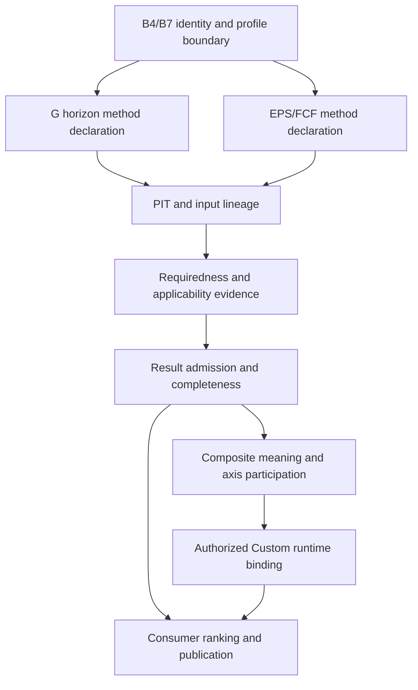

# G methods, Composite and WeightOverride dependency review · 2026-10-05

**D1/D2 READ-ONLY REVIEW / INACTIVE / SYNTHETIC CHARACTERIZATION.**

Exact inspected owner snapshot: `4fb08a05728d83519b72a2bd995669f0cb06003a`. The parent verified fresh remote before delegation. This child did not independently query remote and does not claim that this SHA remains current after its review. B4/B7 explicit user principle approvals are authoritative; the inspected remote documentation still labels them recommended while the active owner is publishing the new records. This report neither duplicates that owner write nor edits production, STATE, handoff, GitHub, old evidence, frozen/golden files or the Decision Package.

The central finding is that G horizon labels, EPS/FCF fallback and downstream composite/profile identity represent different semantic decisions. Method/source lineage can be designed and verified now under B4/B7; intended methods and result-affecting binding still need D3. WeightOverride runtime wiring should follow these decisions rather than supplying their missing authority.

## Current source and impact

| Topic | Exact current source/function | Finding | Consequence |
|---|---|---|---|
| G 3–5Y factor | `qgv/raw_map.py:87 map_raw`, expression at 139 | `next_3_5y_growth` and `revenue_growth` both transform latest revenue YoY through `_growth_to_score`. Its notes disclose that the first is not a 3–5Y forecast. | Label/horizon metadata does not prove the economic meaning. A forecast method replacement is distinct from retaining the current proxy as archival legacy. |
| G horizon metadata | `qgv/pipeline.py:21 analyze_raw`; `qgv/g_horizon.py:74 assess_horizon` | The selected horizon affects `g_horizon`, available/effective quarters and display; `mutates_g_score=False`. The score mapping receives no horizon argument. | A 3Y→5Y view changes no G scoring semantics. Never use READY quarterly coverage as proof of an admitted 3–5Y forecast. |
| EPS→FCF fallback | `qgv/raw_map.py:142` | EPS YoY when computable; otherwise `_yoy(raw.fcf, raw.revenue_prev)`. Shares and prior FCF are not used. | A current FCF/prior-revenue ratio minus one is neither FCF YoY nor FCF/share growth. Missing/zero prior EPS changes the active method branch without first-class method identity. |
| Raw FCF lineage | `contracts/raw.py:RawFundamentals`; `providers/sec_companyfacts.py:218 facts_to_raw` | Adapter computes `fcf_prev`, then drops it; contract contains `fcf` and current `shares`, but no `fcf_prev`, prior shares or FCF/share series. Computed FCF uses current CFO−abs(capex). | Reconstructing a proper fallback requires exact paired periods, units, prior denominator/share basis and source lineage. New values or arithmetic must not be inferred from existing normalized observations. |
| Quarterly FCF monitor | `qgv/quarterly_series.py:83 quarterly_points_from_facts`, assignment at 89 | USD/EUR `FreeCashFlow` is placed directly into the field named `fcf_per_share`; no share conversion occurs. Monitor is RAW_EVIDENCE_ONLY and does not mutate Frozen G. | Preserve historical monitor output, label the unit mismatch in audit, and do not reuse it as valid per-share method evidence. |
| Negative EPS bases | `qgv/raw_map.py:37 _yoy`, 43 `_growth_to_score`; `qgv/g_horizon.py:93 _growth` | Formula checks missing/zero only. EPS losses narrowing −2→−1 map to 0; losses deepening −1→−2 map to 100. | Signed denominator can invert an intuitive growth interpretation. Negative/zero base semantics require an explicit intended-method declaration, rather than a new epsilon or automatic N/A. |
| Financial applicability | `qgv/factors.py:factor_applicable`; `qgv/raw_map.py:map_raw` | Financial exceptions exist for selected Q inputs; G EPS/FCF fallback is the same as corporate fallback. | Current execution is evidence of behavior, not authority that cash-flow growth applies to every financial issuer. Sector method/evidence scope remains unresolved. No roles assigned. |
| Composite | `qgv/analysis.py:58–63`; `qgv/scoring.py:131 attractiveness_10` | Total is `round((Q+G)/2,4)` when Q and G exist; V is excluded. Attractiveness scales Q/G; `type_adjusted_score_100` is the unchanged total. PARTIAL numeric axes can produce a total. | Axis existence is not completeness, ranking eligibility, calibrated type adjustment or a three-axis composite. V lifecycle integration and completeness are prior dependencies to any future formula. |
| Personal weights | `personal/weights.py:95 WeightOverride`, 142 `effective_tree`; `personal/versioning.py:Provenance/ResultNamespace` | Override fields are only node ID and local weight. Registry version/maturity/namespace, ranges, sibling sum, no silent rebase and unset behavior are checked. Zero parent retains child local mix while global contribution is zero. | Reuse numeric tree/version/namespace structures. Existing isolation is not proof that a future QGV evaluator/cache preserves requiredness/PIT. No new ProfileConfig is justified. |
| Runtime wiring | Repository-wide scoped `implementation/src` reference search | `WeightOverride`, `PersonalStrategyVersion`, `effective_tree` appear only in the Personal weights definition within the inspected tree; Q/G scoring still uses fixed dictionaries. | Existing Personal weight-tree arithmetic is not production QGV wiring. Mapping authoritative node/factor/maturity data and runtime/cache/consumer binding remain separate gates. |
| StrategyProfile | `contracts/strategy.py:139 custom_profile` | Frozen q/g weights and unknown method keys are rejected. It is the existing provisional technical/macro/risk parameter pack, not the Personal tree. | Preserve C-24/C-30 boundary; do not repurpose risk parameters to carry method identity or factor policy. |

All source paths above are relative to `implementation/src/investment_system/`. Hashes are in the evidence JSON and final appendix.

## Dependency graph and acyclic ordering

This is a design dependency graph, not authority to execute its D3 boxes. V method/normalization/lifecycle is an additional dependency of Composite participation. Some D1 work on each box can run independently: alternative contracts, lineage manifests, counterexamples and consumer compatibility. Actual calculation selection must not happen before its own approval.

| Dependency | Reason | D1/D2 work available now | D3 decision not made |
|---|---|---|---|
| Method identity → method input meaning | Same factor can dispatch forecast, YoY or fallback under B4 identity; version alone is insufficient if input/fallback differs. | Pin every existing branch to exact source/input contract and preserve unresolved method refs. | New method, horizon or normalization adoption. |
| Method → requiredness/applicability | Inputs required to compute the chosen quantity depend on forecast vs historical/per-share/sector method. | Enumerate dependencies and admitted evidence requirements without assigning REQUIRED/OPTIONAL/CONDITIONAL. | Actual factor/input roles and applicability predicates. |
| PIT evidence → applicability/result admission | Applicability predicates themselves consume source evidence; weights cannot waive the original consumed/shared lineage. | Build source-period/unit/filing precision and revision limitation ledger. | New admissibility rubric or PIT relaxation. |
| Completeness → Composite → consumer | Numeric partial Q/G total does not establish complete three-axis result. | Pin current scalar/state identities; compare proposed independent assessments and downstream representation. | Axes, weights, formula, completeness and ranking criteria. |
| Approved numeric overrides → contribution only | B7 bars changing method/role/truth/Official status. | Verify namespace/config/registry/method ref isolation through synthetic sidecars; preserve the tree. | Registry authority, production evaluator wiring and affected runtime adoption. |

No requirement is inferred from factor weight, missing data, rank, Custom profile or observed use. The graph remains acyclic when consumers request a policy scope but do not redefine source evidence truth or method-requiredness using the resulting rank. Zero weight modifies contribution after admission and does not erase input obligations.

## Narrow remaining semantic surface

The following are separate clauses even if presented in one concise decision package. B4/B7 principles are already user-approved and do not need to be re-approved.

| Clause | Question and alternatives | Recommendation for further convergence |
|---|---|---|
| G-H · intended 3–5Y economic target | Forward forecast/consensus, historical multi-year structural growth, or transparent legacy YoY proxy under its original identity. Forecasts require vintage/horizon/revision evidence; historical growth describes realized trajectory rather than expectations. | Keep old proxy/scores as exact legacy. Draft separate inactive forecast and trailing-horizon declarations with evidence needs and no numeric default; do not choose either new method until D3. Pair comparison with revenue-growth overlap so identical proxy inputs are not mistaken for independent evidence. |
| G-F · EPS/FCF transition and per-share basis | EPS-only with unresolved/missing fallback, explicit FCF/share fallback after paired evidence, or separately displayed cash-flow diagnostic. Negative/zero bases can be separately classified or use another explicitly approved transformation; none is selected here. | Do not recommend continuing the cross-measure current FCF/prior-revenue branch as a semantically correct FCF growth method. Preserve its historical result and expose it in lineage. Prepare a branch-selection/economic-scope contract, including financial applicability and dilution/split/currency/period alignment evidence, then seek approval for the actual method. |
| C · Composite meaning | Retain literal Q/G total, introduce approved Q/G/V participation once V semantics/maturity/admission resolve, or display axes independently with a separately named decision score. | Preserve current total identity and mark current type-adjusted output as uncalibrated historical alias. Design axes/scale/direction/completeness/method refs now. Choose no axis weights or formula; do not smuggle V into existing total by metadata alignment. |
| W · authorized Custom evaluator binding | Reuse existing tree+immutable registry/config/namespace refs and shared evaluator, or defer wiring while Personal view remains diagnostic. | Reuse the current architecture. Complete authoritative factor-node/maturity map, method/namespace/cache/consumer isolation acceptance design before requesting exact runtime wiring. Custom and Official share an approved evaluator version only after authorized binding; archived legacy stays version-dispatched. |

B1 remains MORE_EVIDENCE_REQUIRED. B2/B3/B5/B6 remain recommendation/unapproved for the actual admission/consumer policy. Their consolidated package can carry independent result and consumer assessments without collapsing them into one boolean. Concrete financial predicates, negative-base transforms, completeness rules, numeric defaults, Composite participation/weights, runtime wiring and migration are not selected by this review.

## PIT, economic scope and failure modes

| Failure mode | Why it matters | Contract treatment to investigate, not production selection |
|---|---|---|
| Forward forecast retrieved today for past decision | A future-valued forecast can be legitimate only if it was available at that decision; latest revision is not past availability. | Bind forecast origin, published/available times, snapshot/vintage/hash, target period/horizon and revision chain; no fetched-at substitution. |
| Date-only SEC filing | Legacy resolver can use `filed` or `end` and coerces a date to midnight. This is a known precision limitation, not exact intraday proof. | Retain date/interval uncertainty and source provenance; do not upgrade it to precise PIT eligibility in a new sidecar. No time policy is changed. |
| Mismatched financial periods or units | Current fields combine selected concepts and may not carry matching period/share basis. Ratios can be finite while economically wrong. | Declare paired period/start/end, currency/unit, taxonomy/concept, amendment accession and denominator basis. No constant conversion or currency policy is chosen. |
| Negative or zero base | Finite division can reverse loss improvement or route zero EPS to a different fallback. | Explicit branch reason and method identity; reject silent same-method assumption. Compare missing/unresolved/diagnostic candidates without choosing numeric transforms. |
| Shares change/split/dilution | Total FCF growth and per-share FCF growth can diverge. Current fallback ignores shares and prior shares. | Exact security/issuer scope, period share basis and corporate-action lineage are method prerequisites; current shares are not prior weighted-average diluted shares. |
| Sparse quarterly coverage | `assess_horizon` counts observations; rows can have only one field, and no factor-level forecast method is computed. | Separate per-metric matched coverage/completeness from general row count. Choose no new percentage/cutoff. |
| Financial issuer | Generic corporate FCF can need different interpretation and unit/sector evidence. | Seek method-specific economic applicability authority, rather than automatically declaring missing FCF N/A or cutting denominator. |
| Zero Custom weight | Computation may contribute zero while method/provenance/PIT obligations remain. | Preserve B7 invariant and original rejected evidence; tree arithmetic alone is not future runtime proof. |
| Partial axis + numeric total | Downstream scalar can obscure failed input/completeness meaning. | Producer-owned assessment → consumer admission refs; no consumer rescoring, automatic rank, publication grant or Official promotion. |

## Bounded verification and limitations

**20/20 current-behavior checks PASS**. Evidence: `g_profile_checks.json`, SHA-256 `00bb57fb13ee92240a5b98c01740301665ae8840a24eddfa207a6be0702dcd7c`.

Synthetic checks verify 3Y/5Y metadata with unchanged G, the identical revenue-YoY proxy, missing-EPS fallback, shares invariance, no prior-FCF/share fields, negative-base inversion, zero-base fallback, financial branch equivalence, missing-not-zero, quarterly USD FCF in a per-share field, future filing exclusion, V excluded from total, unchanged type-adjusted alias, zero-parent local/global mix, unchanged registry hash, Official override rejection, method/frozen-weight key rejection and numeric-only WeightOverride shape.

These are source-characterization assertions, not acceptance of the current economic method as correct or tests of a new runtime. All fixture values are synthetic and contain no company recommendation. Full regression/Actions/real PIT-OOS/Holdout/migration/production wiring/scheduler hops were not run. Existing source/historical/golden bytes are not rewritten. Existing resolved PIT behavior does not authenticate absent forecast/FCF/share evidence.

## Exact next autonomous D1/D2 step

Compile a source-pinned **G method input lineage readiness matrix** for the already-audited `next_3_5y_growth` and `eps_fcf_per_share_growth` branches. Reuse the owner method replay manifest when its active owner publishes it; do not compete for the same HOP1 task. Record actual source concept/unit/period/vintage/availability precision, branch selection and unrepresented prior-FCF/share dependencies. Include independent negative/zero-base, financial, period/currency and split/share-change synthetic fixtures with unchanged legacy outputs. Produce an inactive candidate-method comparison with unresolved cells; assign no requiredness, thresholds, economic replacement or runtime binding. Independent V/consumer work can continue while G methods await D3.

## Exact pinned hashes

| File | SHA-256 |
|---|---|---|
| `implementation/src/investment_system/qgv/raw_map.py` | `79995e768babddf8f7d85e0d10a4a9bb3f7571138520975e569670adea1ff0ac` |
| `implementation/src/investment_system/qgv/g_horizon.py` | `c5241f9178aba9103e663b267fd58818face6cf3c5721b21ee53c8969f091ba2` |
| `implementation/src/investment_system/qgv/pipeline.py` | `00e95ad07d827988f3191fbd2f2fc343133f640a12a58168d20106d227a11ef4` |
| `implementation/src/investment_system/qgv/quarterly_series.py` | `1666839c6865b1187cff068bc7881f4e9658457f43b79ca7ded12fa98d89f5cb` |
| `implementation/src/investment_system/qgv/scoring.py` | `1aa4802a65175210be802c7d1d08e17e8af5cfa40a9b6faaa014447354d9e629` |
| `implementation/src/investment_system/qgv/analysis.py` | `bfd4e1310dde9f908f60a8a2030cb9928f4267f73180c3eb5b12bc7947e3de88` |
| `implementation/src/investment_system/qgv/factors.py` | `0df21503c383e3ff79a91bf143c003a8e131718918eb1fe57abecea7e6781a6e` |
| `implementation/src/investment_system/contracts/raw.py` | `52b3606eeb8c45016661f949b9af78f7b3f9532987842e2c3a8dc905dd89253a` |
| `implementation/src/investment_system/contracts/models.py` | `5313bbd41224da718580ba529f622d091787d33d62d70c6d5a6bc3073d6ac506` |
| `implementation/src/investment_system/contracts/strategy.py` | `9c34249656ac7ba0203546584f7acd2dd96c6f2debb7ba54d54069290cbfe9ac` |
| `implementation/src/investment_system/providers/sec_companyfacts.py` | `fe236b817858b9698fb2e74d0fe460a46de2e83000134f68ca38f3ab60ee055a` |
| `implementation/src/investment_system/providers/sec_vintage.py` | `e0aecc5c02bafa9e9543b03af8fb6a9c961df1f40217b3099829b1934f1c42fd` |
| `implementation/src/investment_system/personal/weights.py` | `2bfdb278feaa3892e9c2b0129419b93c7725570a81b37fe5d6643228357b14f5` |
| `implementation/src/investment_system/personal/versioning.py` | `af84bfd95e198c3e1c29381ca9d688728da8a7a128dec4994da49d5186416def` |
| `implementation/docs/qgv_common_contract_vnext/CONTRACT.md` | `a7dabcf20b4016964367a5846f3903dae7a3c3985b22af2e59b99474486bf4d8` |
| `implementation/docs/qgv_common_contract_vnext/missing_data_gate/implementation_contract/CONTRACT.md` | `5203e09c36c612aa573789a5cdf8bcf1fb76f26fad105171e21b31828e13f76b` |

Reproduction: `g_profile_probe.py` executed against the exact owner pin with bytecode disabled; second output equals the original JSON exactly. Probe SHA-256: `595032d8c0e4a78c7bb575f5fbf1972e90d0362ac0e14381dee143f2dfeef850`. Invoke with owner `implementation/src` on PYTHONPATH, `--owner-root` at the pinned worktree and `--out` to scratch. It rejects a changed owner HEAD rather than silently rebasing. The source tree remains read-only; parallel root docs are outside this child ownership.
