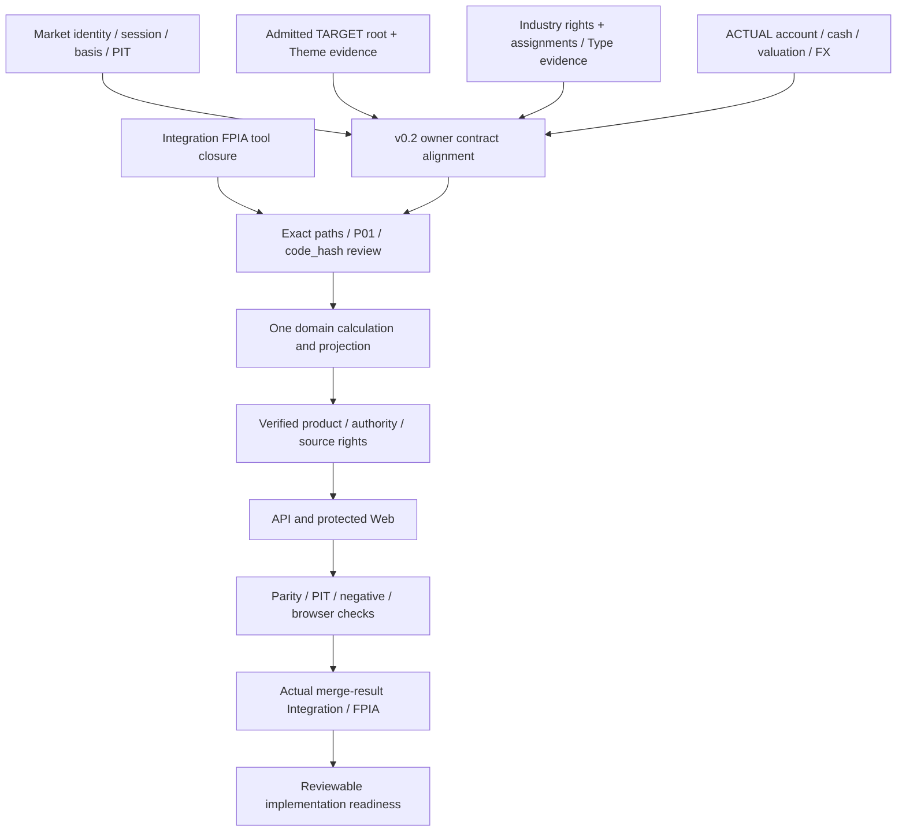

# Investment-System1 P0 Market / Portfolio Classification Review v0.3

Status: **READ_ONLY_AUDIT / DESIGN_PROPOSAL / PRODUCTION_IMPLEMENTATION_NOT_STARTED**.
Checkpoint: 2026-10-05 KST. This is an additive report, not ChartDocument v0.3 or approval of a production contract.

## 1. Executive Summary

GitHub fresh-read에서 Chart Draft PR [#41](https://github.com/kco994553-star/Investment-System1/pull/41)의 시작 HEAD는 `54ee25446ccf6cfa32ddf164a8ed31b7e1036b9a`였다. 기존 audit baseline `8668c69070c7956cb85d1ccf8cbeb8d9d2daf5cf`, v0.1 설계, v0.2 prerequisites, raw responses와 **Core 81 / Extended 24 / Research Candidates 8**을 보존한다. Canonical은 `b8e39a2196a6d7794a04a0cd5393c68329e126ca`였다. 아래 판정은 확보된 repository/source evidence 범위이며 외부 계정이나 미확보 licensed feed의 부재를 단정하지 않는다.

Market 19개 공급자 symbol의 23,155행을 유지했다. 결측 1행과 OHLC envelope 실패 4행은 새 조회에서도 유지되며 원인은 UNKNOWN이다. 19개 별도 action 요청에서 dividend 283건, split 9건을 후보로 확보했다. 기존 OHLCV는 모두 같지만 adjclose exact numeric token 10,862개가 달랐다. 요청 parameter와 관측 시점이 다르므로 경제적 revision이나 오류로 단정하지 않는다.

남은 production blocker는 stable security/listing/series binding, 거래 regime, per-field adjustment basis, 증거가 있는 session/calendar join, historical availability 및 chart product authority다. 자료 획득 성공은 production READY가 아니다.

Portfolio는 **Industry / StrategyTheme / InvestmentType / TypeOverlap**을 구분한다. Overlap은 InvestmentType의 완전한 exact membership set에서 파생하는 view다. 기존 30/25/20/25% bucket은 사용자 전략 배분으로 보존한다. ACTUAL은 NOT_AVAILABLE이고 TARGET fallback은 금지한다. Target Theme는 독립적인 PARTIAL 경로이며 GICS/Type/quarterly history 부재가 이를 자동으로 막지 않는다. GICS의 적법한 assignment는 admitted **0/19**다.

Integration PR [#42](https://github.com/kco994553-star/Investment-System1/pull/42)의 `523e702`에서 FPIA CI PASS를 실제 로그로 확인했다. 그러나 D3/independent review/GIE 기록과 구현 gate는 닫히지 않았다. Chart를 포함한 실제 merge-result에 대한 검증도 아니다. Protected Web/assembler, package production Python, Frozen, grant, Official/LIVE, Holdout, canonical merge와 다른 owner branch는 변경하지 않았다.

## 2. Market P0 Readiness

READY는 **명시된 field/source 범위**의 증거만 뜻한다. PARTIAL은 일부 증거가 있지만 production binding이 미완료라는 뜻이다. NOT_AVAILABLE은 이 감사에서 필요한 데이터/근거가 확보되지 않았다는 뜻이며, BLOCKED는 해당 capability를 production으로 사용할 수 없다는 뜻이다. UNKNOWN인 값은 상태 enum으로 꾸며 채우지 않는다.

| Field / capability | 판정 | 실제 확보 / 남은 경계 |
|---|---|---|
| 원본 응답·hash·request provenance | READY — captured revision | 기존 19 raw bytes 보존; 새 action captures는 별도 request/revision |
| provider symbol·현재 issuer/exchange association | PARTIAL | SEC의 17 US association, TEL 8035, DART Hanmi 042700 근거; stable internal ID/history 인증과 별개 |
| internal security ID / listing history | NOT_AVAILABLE / BLOCKED | 현재 association만으로 ticker change·delisting/relisting·CA identity continuity를 연결하지 않음 |
| bar timestamp / date | READY — raw value | epoch와 timezone-local date 보존; timestamp role은 PARTIAL, 실제 open/close로 자동 해석 금지 |
| timezone / 정상 거래시간 | PARTIAL | New York / Tokyo / Seoul 근거 확보; session별 admitted calendar binding 미완료 |
| early close·holiday·예외 session / calendar version | PARTIAL / BLOCKED | Nasdaq 2021–2025 calendar, Carter closure, JPX go-live, KRX CSAT 공지 확보; 전체 source-vintage join 미인증 |
| event_time / session close / provider timestamp | NOT_AVAILABLE / PARTIAL — 역할별 | per-bar event_time·certified session close는 NOT_AVAILABLE; latest regularMarketTime은 PARTIAL. raw bar timestamp와 quote print/currentTradingPeriod를 session close에 대입하지 않음 |
| observed_at / acquisition | READY — audit receipt 범위 | 이번 capture의 관측만 입증; source ingestion time은 별도 미확보 |
| historical provider available_at / knowledge_time | NOT_AVAILABLE / BLOCKED | 과거 bar/action revision의 공개·접근 가능 시각 미확보. Git/fetch/close time으로 backdate 금지 |
| Open / High / Low / Close / Volume | 17 symbol READY, 2 PARTIAL — 구조 범위 | Hanmi all-null 1행; Tokyo 1·Hanmi 3 envelope 실패. 원본 보존, admission 별도 |
| source adjclose | PARTIAL — basis / revision | 별도 field 존재; 이를 O/H/L/V와 섞은 adjusted candle 금지 |
| unadjusted full OHLCV pair | NOT_AVAILABLE | 공급자 quote fields를 unadjusted라고 인증할 근거가 없음 |
| per-field split/dividend/volume basis | PARTIAL / BLOCKED | action candidates와 primary 날짜 근거는 확보; 적용 lineage·coverage·availability 미인증 |
| exact response quote_state | NOT_AVAILABLE — value UNKNOWN | 19 응답에 명시적 state 근거 없음; LIVE/DELAYED/CLOSE 추정 금지 |
| production Market ChartDocument | BLOCKED | upstream binding·owner calculation·schema registration·publication 미완료 |

시간 반례: US raw daily timestamp는 통상 09:30 New York와 대응하지만 이것은 공급자 timestamp 관측이다. KRX 2025-11-13 CSAT session은 공식 **10:00–16:30**인데 Hanmi raw timestamp는 **09:00 KST**다. Tokyo는 2024-11-05부터 정규 close가 15:30으로 변경된 실제 go-live 근거를 확보했다. Hanmi currentTradingPeriod의 15:00 end와 KRX 정상 close 15:30도 분리한다. 따라서 단일 고정 clock이나 timestamp==actual open 규칙은 이식할 수 없다.

Yahoo 공식 도움말의 exchange-level 일반 설명은 Nasdaq realtime, Tokyo/Korea 20-minute delay를 제시하지만 해당 v8 historical response의 per-row quote_state를 인증하지 않는다. 확보한 표에 NYSE stock-equity 행은 없고 NYSE Index 행을 주식에 적용하지 않는다. Daily historical series라는 사실도 CLOSE feed-state를 입증하지 않는다. **price feed state != Investment-System Official/LIVE state**.

재사용: 기존 fetch/raw-store/hash/parser와 exact numeric-token replay를 우선한다. Canonical Yahoo scalar-close transform, close-only Tiingo fallback 또는 raw manifest만으로 full OHLCV를 만들지 않는다. 기존 US CalendarVintage/binder는 US 한정이며 외국시장 map 추가만으로 session 지원을 확장할 수 없다. 원본 blob이 없는 manifest는 historical evidence로 인증하지 않는다.

상세: [identity/session audit](market-identity-time/MARKET_IDENTITY_TIME_AUDIT_v0.3.md), [19 × 39 field matrix](market-identity-time/MARKET19_IDENTITY_TIME_READINESS.json), [basis/anomaly audit](market-basis-anomalies/MARKET_BASIS_AND_ANOMALY_AUDIT_v0.3.md), [19-symbol basis matrix](market-basis-anomalies/MARKET_BASIS_READINESS_19_v0.3.json).

## 3. 19-symbol Coverage

다음 기간은 **이번에 확보한 공급자 series 범위**이며 전체 listing history나 각 기간의 PIT 사용권을 뜻하지 않는다. 전 종목 internal security binding 미인증, historical available_at NOT_AVAILABLE, quote_state UNKNOWN, production admission BLOCKED다. 현재 association과 과거 연속성은 별도다.

| Provider symbol | 현재 association 후보 | 첫 bar | 마지막 bar | rows | complete OHLCV | envelope 실패 |
|---|---|---|---|---:|---:|---:|
| ASML | Nasdaq / ASML US share form 별도 근거 | 2021-10-04 | 2026-10-02 | 1,255 | 1,255 | 0 |
| LRCX | Nasdaq | 2021-10-04 | 2026-10-02 | 1,255 | 1,255 | 0 |
| KLAC | Nasdaq | 2021-10-04 | 2026-10-02 | 1,255 | 1,255 | 0 |
| NVDA | Nasdaq | 2021-10-04 | 2026-10-02 | 1,255 | 1,255 | 0 |
| AMD | Nasdaq | 2021-10-04 | 2026-10-02 | 1,255 | 1,255 | 0 |
| AVGO | Nasdaq | 2021-10-04 | 2026-10-02 | 1,255 | 1,255 | 0 |
| QCOM | Nasdaq | 2021-10-04 | 2026-10-02 | 1,255 | 1,255 | 0 |
| INTC | Nasdaq | 2021-10-04 | 2026-10-02 | 1,255 | 1,255 | 0 |
| MSFT | Nasdaq | 2021-10-04 | 2026-10-02 | 1,255 | 1,255 | 0 |
| GOOGL | Nasdaq / share class 유지 | 2021-10-04 | 2026-10-02 | 1,255 | 1,255 | 0 |
| AMZN | Nasdaq | 2021-10-04 | 2026-10-02 | 1,255 | 1,255 | 0 |
| RTX | NYSE | 2021-10-04 | 2026-10-02 | 1,255 | 1,255 | 0 |
| SYK | NYSE | 2021-10-04 | 2026-10-02 | 1,255 | 1,255 | 0 |
| ETN | NYSE | 2021-10-04 | 2026-10-02 | 1,255 | 1,255 | 0 |
| GEV | NYSE / trading-regime 미바인딩 | 2024-03-27 | 2026-10-02 | 632 | 632 | 0 |
| HUBB | NYSE | 2021-10-04 | 2026-10-02 | 1,255 | 1,255 | 0 |
| ROK | NYSE | 2021-10-04 | 2026-10-02 | 1,255 | 1,255 | 0 |
| 8035.T | Tokyo Electron / TSE Prime | 2021-10-04 | 2026-10-02 | 1,222 | 1,222 | 1 |
| 042700.KS | Hanmi Semiconductor / KOSPI | 2021-10-05 | 2026-10-02 | 1,221 | 1,220 | 3 |
| **Total** | **19 provider symbols** | | | **23,155** | **23,154** | **4** |

GEV issuer는 when-issued 시작을 약 2024-03-27로 **예고**했으며, regular-way GEV 시작은 2024-04-02에 실제 확인했다. 공급자 `GEV` series의 2024-03-27·28·04-01 세 bar는 **when-issued 후보**로 flag한다. 예고만으로 actual 시작이나 exact binding을 확정하지 않는다. exact listing/trading-regime binding 전 regular-way history로 합치거나 relabel/delete하지 않는다. `8035.T`는 bare `TEL`이나 TELWY ADR과 별개의 공급자 symbol이다.

## 4. Raw Anomalies

모든 아래 timestamp는 원본 **00:00 UTC / 09:00 해당 local timezone**이다. security는 provider symbol로 정확히 식별했으며 internal security identity는 미바인딩이다. Cause / verified explanation은 전부 **UNKNOWN / 없음**이다.

| Provider / bar date | epoch / row index | exact 실패 | affected source fields |
|---|---|---|---|
| 8035.T / 2022-05-17 | 1652745600 / 149 | C=3869.333251953125 > H=3866.666748046875 | OHLC envelope |
| 042700.KS / 2024-01-15 | 1705276800 / 560 | C=56200 < L=56600 | OHLC envelope |
| 042700.KS / 2024-10-14 | 1728864000 / 740 | C=109500 < L=110200 | OHLC envelope |
| 042700.KS / 2025-04-09 | 1744156800 / 859 | C=61200 > H=60700 | OHLC envelope |
| 042700.KS / 2025-09-19 | 1758240000 / 970 | O/H/L/C/V 전부 null | OHLCV missing |

Deterministic rule은 source token을 Decimal로 읽어 `low <= open <= high`와 `low <= close <= high`, required field presence를 검사한다. tolerance/epsilon/수정값은 도입하지 않았다. [Immutable anomaly ledger](market-basis-anomalies/IMMUTABLE_RAW_ANOMALIES_v0.3.json)는 원본 전체 SHA-256, 원본 path, JSON pointer, row index, exact tokens, 비교 capture/hash와 downstream impact를 담는다. Tokyo raw SHA는 `4b73393390ac0f41865f6ceab82e682d4b3a69fcf9d42b8264b3ca908c7eb758`, Hanmi raw SHA는 `0fd4f74e03fa3908dda2ae4b7970537fef9e1d855003bd7179c6a3f180390552`다.

Rendering 정책 **제안**: invalid candle 자체는 block; 진단 view는 원본과 reason을 annotate; owner가 승인한 explicit gap/degrade 정책이 없으면 series도 block. 해당 bar에 의존하는 indicator/window는 owner validation 전 block 후보다. silent repair/drop/interpolation은 하지 않는다. 13개 zero-volume row는 null-volume과 구분하며 결측으로 추가하지 않는다.

Action 근거는 원인 설명이 아니다. Lam effective-after-Oct2 / first adjusted trade Oct3, Broadcom distribution Jul12 / adjusted trade Jul15, KLA effective-after-Jun11 / adjusted trade Jun12 같은 날짜 역할이 다르다. Tokyo의 provider event date와 record/effective date도 동일 role로 대입하지 않는다. Action coverage/available_at은 미인증이다. 10,862 adjclose 차이도 원인 UNKNOWN으로 유지한다.

## 5. GICS Feasibility

GICS는 objective industry exposure의 **조건부 우선 후보**다. Sector 기본 → Industry Group → Industry → Sub-Industry drill-down은 PROPOSAL_NOT_ADOPTED다. 공식 taxonomy 설명은 확보했지만 이를 회사별 assignment feed로 취급하지 않는다.

판정: **GICS source product 존재 / production assignment 및 entitlement 미확보 / Target GICS BLOCKED**. 프로젝트가 적법하게 사용할 수 있다고 인증한 assignment는 0/19다. 기존 Wikipedia raw에는 16/19의 GICS-labeled 열이 있다. 이는 별도 secondary candidate이며 current/history/rights/PIT 계약을 충족하지 않는다. ASML·8035.T·042700.KS는 그 snapshot에 없다. 이 자료나 SEC SIC / JPX SICC / KRX KIND를 GICS로 변환하지 않는다.

## 6. GICS Data / Licensing / Historical Classification 상태

| 항목 | 근거와 현재 상태 |
|---|---|
| taxonomy / methodology | 공식 현재 링크는 **April 2026** methodology. 이전 February 2025 근거는 역사로 보존 |
| current issuer assignments | 공식 GICS Direct 상품 존재; 이 프로젝트 feed/sample/admitted assignment NOT_AVAILABLE |
| historical assignments | GICS History 상품 존재; 실제 record/schema/revision/19 coverage 미확보 |
| effective date | 상품 설명의 historical from/thru는 validity 후보; 실제 assignment record 미확보 |
| publication / available_at | from/thru·taxonomy revision으로 대체 불가; historical publication/receipt evidence NOT_AVAILABLE |
| assignment scope / corporate changes | company-linked classification과 review methodology 근거는 확보; security/issuer join은 별도 |
| licensing / redistribution | user-specific 계약·entitlement 확인 안 됨. private/public Web·API·derived output·MCP·retention 범위 별도 확인 필요 |
| 2026 AI/semiconductor consultation | 진행 중 proposal로 관측; 채택 taxonomy로 사용하지 않음 |
| crosswalk | SIC/SICC/KRX→GICS는 별도의 versioned mapping problem. 설계·adoption 없음 |

MSCI의 2026-07-15 TOU는 Order Form 없는 기본 사용의 non-production 범위 및 별도 허용이 필요한 사용을 규정한다. S&P 공개 website terms도 assignment 데이터 구입 계약을 대체하지 않는다. 개인용 MVP라고 자동 허용하지 않으며, 어느 공급자의 실제 계약도 확보하지 않았으므로 적법한 사용권은 UNKNOWN이다. **외부 source-use rights와 내부 publication grant는 독립 gate**다.

상세 및 공식 URL/짧은 source excerpt: [GICS feasibility audit](gics/GICS_FEASIBILITY_AUDIT_v0.3.md), [source register](gics/SOURCE_REGISTER.json). 원문 전체를 복사한 권리 증거로 꾸미지 않았으며 bounded excerpt hash는 원문 bytes hash가 아니다.

## 7. Strategy Theme Architecture

`반도체 장비 / AI·반도체 / Big Tech / 기타산업`은 **Strategy Theme / Portfolio Bucket**이다. 질문은 “사용자 전략의 어느 부분에 목표 자본을 배분하는가?”다. legacy reference의 `industry` 필드와 19개 membership·30/25/20/25%·target history는 그대로 보존하고 successor projection에 새로운 dimension 의미를 명시한다.

Theme assignment는 strategy/portfolio scope, 사용자 또는 system owner, catalog/version, source row/hash, rule 또는 authored decision, effective period, available_at/관측 근거를 갖는다. 기존 날짜나 Git receipt를 과거 publication으로 backdate하지 않는다. 현재 네 bucket은 단일 partition이다. 미래 multi-theme policy는 UNDECIDED이며 임의 normalize하지 않는다. StrategyTheme와 InvestmentType의 `Theme(테마)` label은 별도 namespace다.

현재 Theme target evidence는 **PARTIAL**: source/reference 의미는 확인했으나 production TARGET root·numeric/source admission·현재 사용 scope·product authority가 미완료다. GICS·ACTUAL·quarterly history를 새 필수 dependency로 붙이지 않는다.

## 8. Investment Type Architecture

질문은 “같은 portfolio base 중 각 투자 특성에 노출된 비중은 얼마인가?”다. Growth/Value/Quality/Cyclical/Defensive/Dividend/Leader/Theme 등 기존 후보 label을 보존하지만 실제 19개 기업 membership은 unresolved다. synthetic assignment를 production으로 승격하지 않는다.

Assignment 요구: type concept/namespace, subject/granularity, source/artifact/hash, methodology/rule/version, catalog version, assignment revision, effective_from/to, available_at 및 evidence, membership completeness, 필요시 confidence/evidence. confidence 값을 임의 생성하거나 weight에 곱하지 않는다. catalog 정의와 subject assignment는 다르다.

하나의 security는 여러 Type에 속할 수 있으며 **Type Exposure Total > 100%**는 정상이다. 공통 authoritative denominator를 유지하고 Type 합계를 100%로 normalize하지 않는다. 현재 **NOT_AVAILABLE / BLOCKED**다.

## 9. Type Overlap Architecture

질문은 “각 portfolio 부분은 어떤 exact Type set에 속하는가?”다. 같은 subject weight는 정확한 set 하나에 한 번만 들어간다. `{Growth, Quality, Leader}`와 `{Growth, Quality}`는 다른 bucket이다. 전자를 후자나 각 개별 Type exposure에 다시 합산하는 overlap 계산은 금지한다.

Key는 선택된 catalog namespace/version과 canonical concept-ID set이다. localized label, insertion order, subject별 assignment revision을 bucket key로 사용하지 않는다. 동일 exact set의 서로 다른 assignment revisions는 provenance로 남기고 합산한다. multi-account는 domain이 먼저 authoritative security exposure로 집계하며 renderer가 다시 계산하지 않는다.

Complete known set / complete empty set / partial set / unresolved / cash를 구분한다. Growth가 있다는 근거만으로 나머지 Type 부재를 확정할 수 없다. partial/unknown은 verified exact bucket이 아니다. Overlap은 별도 taxonomy가 아닌 Type의 derived view이며 현재 Type와 함께 **NOT_AVAILABLE / BLOCKED**다.

## 10. TARGET / ACTUAL 상태

| 대상 | 현재 상태 | 보존할 contract |
|---|---|---|
| TARGET reference | 19 authored rows; four buckets; cash 0; production PARTIAL | Allocation row shape·owner target values·revision/root 유지. broker quantity/valuation을 만들지 않음 |
| ACTUAL positions / accounts | NOT_AVAILABLE | 실제 broker/user-entered snapshot·account scope·completeness·source/time 필요 |
| ACTUAL market value / weights | source NOT_AVAILABLE, domain calculation 존재 | Decimal 기존 total_value/weights 재사용; position+cash denominator와 multi-account aggregation |
| FX / PIT | owner 경로 존재, 실제 snapshot lineage 미확보 | original money·FX quote/available_at·converted result/context와 valuation refs 보존 |
| quarterly history | admissible target/actual/classification/valuation sequence 미확보 | 현재 composition과 별도 capability. 현 분류로 과거 quarter를 재구성하지 않음 |

`actual_weight ?? target_weight`는 production에 사용할 수 없다. Model/QGV의 target-derived actual_weight도 실제 계좌 증거가 아니다. 실제 source가 없으면 ACTUAL=NOT_AVAILABLE를 반환한다. 기존 Web fallback 수정은 Web owner의 후속 protected/contract task로 남겨두었다.

## 11. ChartDocument v0.2 판정

v0.1은 논리적 baseline으로 유지하지만 production evidence binding은 충분하지 않다. 별도 [ChartDocument v0.2 Proposal](CHARTDOCUMENT_v0.2_PROPOSAL.md)은 **PROPOSAL_NOT_ADOPTED**다. 기존 v0.2 prerequisite 문서를 rewrite하지 않는다.

| 기존 후보 | 판정 | 필요한 evidence binding |
|---|---|---|
| C01 immutable payload/hash ↔ current authority envelope | KEEP | source/request revision과 hash preimage/schema pin; 현재 invalidation을 immutable payload에 덮어쓰지 않음 |
| C02 Decimal raw / owner context / result | KEEP | original numeric type/token, owner execution context/result/hash. renderer rounding으로 금융값 재계산 금지 |
| C03 NOT_AVAILABLE / diagnostic / valid empty | CHANGE | field/range/capability, unknown/partial/complete-empty/cash, invalid candle diagnostic 구분 |
| C04 position/cash/valuation/FX source binding | CHANGE | independent TARGET allocation root와 ACTUAL source root; 적용되는 input별 lineage; target에 가짜 position 금지 |
| C05 timestamp/session/knowledge-access 분리 | CHANGE | session calendar/vintage, actual role, GEV trading regime, provider available_at UNKNOWN 보존 |
| C06 catalog/assignment/completeness | CHANGE | Industry/StrategyTheme/InvestmentType 및 derived Overlap; catalog와 assignment revision·effective·available 분리 |
| C07 exact publication/invalidation subject | KEEP | basis/root/dimension/revision/consumer scope/decision-time의 exact binding; feed state와 product state 분리 |

**DROP=0.** 추가 C08 proposal: source rights evidence를 product authority와 분리한다. 보강 요구는 denominator provenance, exact membership completeness, source numeric basis/revision, signed/leveraged unsupported capability, 현재 composition vs quarterly/PIT history의 별도 gate다. 신규 runtime enum·threshold·numeric policy·schema를 채택하지 않았다.

Logical relation: `PortfolioSnapshot(TARGET | ACTUAL)` → basis-specific `AllocationRow[] | PositionEvidence[]` + `ClassificationCatalog/AssignmentRevision` → 하나의 domain-owned `ClassificationExposure` → Industry / Theme / Type / derived Overlap. Assignment 생산과 aggregation을 분리하고 API/Web/future MCP는 같은 verified result를 조회한다.

## 12. FPIA / Protected Dependency

Fresh PR #42: Draft/Open, HEAD `523e702a806a718d163cfbf62aa3fc29d8c3ef3c`, base `acaf1b5a82859ac2750a130ebe88f8b4d272ac66`. [FPIA run 37234682864](https://github.com/kco994553-star/Investment-System1/actions/runs/37234682864) 실제 subject는 PR HEAD이며 synthetic merge `0db0d30`가 아니다. 7개 해당 owner workflow의 success도 확인했다.

로그: FPIA_PASS, CODE_IDENTITY_DIVERGED `0ef3a900`→`df34b84f`, Frozen-tools-on-T FAIL은 별도 BRANCH_FROZEN_VALIDATION으로 유지, historical Frozen identity / Track C projection / v2 binding / full regression PASS, interference NONE. Tool CI 확인과 Frozen PASS를 혼동하지 않는다. 전체 artifact 독립 replay는 NOT_RUN이다.

구현 gate는 **미종결**이다: D3-a auditor trust, D3-b job-id collision, D3-c dynamic invocation non-claim, D3-d importer attribution, G7 trigger 해석, 독립 review와 GIE 기록이 남았다. Global `9d9b2b2`의 in-progress handoff는 새 CI PASS 이후 closure record가 아니므로 각각의 scope로 보고한다. CDR-014의 P01 repin/Frozen/canonical 금지는 그대로다.

| 구현 항목 / exact placement | protected 영향 | P01 digest | Track C package code_hash | Integration/FPIA |
|---|---|---|---|---|
| 이번 scoped docs/raw/non-package audit tools | 없음 | direct 영향 없음 | direct 영향 없음 | 향후 candidate tree attribution/review |
| package Market adapter·session projection | owner path 필요 | seven-file 변경시에 영향 | **영향 있음** | tool closure + exact result + owner parity |
| package Portfolio/Decimal/classification projection | Frozen personal 변경 금지 | path-dependent | **영향 있음** | source/domain owner + exact result |
| chart product registration/new package validator | producer owner | assembler 연결시 **영향** | **영향 있음** | publication/schema negative tests + exact result |
| product/web_mvp.py 또는 producers/assembler.py | **protected** | **영향 있음** | **영향 있음** | Web/Producer/P01 + 별도 digest route + exact result |
| web_assets/app.js 단독 | Web owner | seven-file digest에는 없음 | Python hash direct 영향 없음 | schema/authority/browser 및 exact integrated tree |
| API / 향후 MCP transport | placement-dependent | placement-dependent | package Python이면 영향 | 동일 contract/authority/result parity; MCP 이번 범위 아님 |

P01 seven files: `qgv/pipeline.py`, `qgv/leaderboard.py`, `qgv/book.py`, `technical/engine.py`, `macro/engine.py`, `product/web_mvp.py`, `producers/assembler.py`. **PR #42 exact head `523e702` 기준** observed digest는 C28 adopted `e6de46714f4405b52d4b25a418cc4081ff6df9d8891f332f59cc47e5ccc6c909`와 일치하며 repin하지 않았다. 동일 head의 Track C code_hash는 package 전체 `*.py` 204개를 포함해 `df34b84f54308fda6f084d59a574aa5da2cebdcd88b5c764b2ec2de2b63415d0`다. 빈 Python 파일 추가도 identity에 영향을 준다.

상세: [exact FPIA evidence](contract-integration/FPIA_FRESH_READ_EVIDENCE.json), [candidate/owner review](contract-integration/CHARTDOCUMENT_V02_CANDIDATE_AND_FPIA_REVIEW_v0.3.md).

## 13. 지금 바로 구현 가능한 부분

사용자가 허용한 non-protected prerequisite 범위: 새 source receipt/hash와 19-symbol field matrix, immutable anomaly replay, timestamp-role/session-exception 근거, CA 날짜 역할, Theme source description와 versioned classification evidence, v0.2 proposal, owner/path/impact plan. 이번에 이 범위를 실행했다.

후속으로 production package 밖에서 offline acceptance examples와 source replay diagnostics를 보강할 수 있다. 이미 확보된 원본/provider/parser를 재사용하고 owner workflow에 자동 연결하지 않는다. GICS entitlement/sample/history 확인, unresolved identity/Type evidence 수집도 audit로 가능하다. 구매·라이선스 commitment·account 연결·grant·schema adoption은 이번 허용 범위가 아니다.

## 14. 아직 구현하면 안 되는 부분

Protected Web validator/assembler 변경, package-level production adapter/projection, Frozen contract 변경, Official/LIVE 승격, grant 발행, Holdout 접근/소비, PIT/no-lookahead 완화, Track C Frozen contract/record 변경, canonical merge, 다른 owner branch 수정. FPIA PASS 하나만으로 이 금지가 해제되지 않는다.

GICS source/rights/assignments 없이 GICS라고 표시하기, SIC/SICC/KRX 임의 crosswalk, 실제 근거 없는 Type assignment, actual fallback, adjusted close만 바꾼 candle, anomaly silent repair, 과거 available_at 추정, renderer/API/MCP에서 별도 금융 계산도 시작하지 않는다.

## 15. P0 Implementation Dependency Graph

각 dependency는 **선택한 capability의 필요한 inputs만** 적용한다. Target Theme에 K/GICS, A/ACTUAL, 과거 quarterly history가 필수라는 뜻이 아니다. GICS/Type/ACTUAL은 각각 독립적인 unavailable 상태를 유지할 수 있다. 현재 source-ready Target Theme가 가장 짧은 후보 경로다. Historical chart에는 그 기간의 listing/calendar/action/classification/valuation/input revision과 knowability가 추가로 필요하다. MCP는 향후 P의 동일 verified contract를 읽으며 별도 계산을 하지 않는다. Diagram은 merge나 publication approval이 아니다.

## 16. 새로운 D3 / 사용자 결정 필요 여부

이번 audit를 완료하기 위한 **새 사용자 결정은 없음**. 기존 Integration D3-a/b/c/d 및 G7은 Integration owner 경로의 미해결 dependency다. 이를 Chart 작업자가 대신 결정하지 않는다.

후속 production 착수 전에 결정할 후보는 GICS 사용권/source 계약, 명시적 대체 taxonomy 및 별도 crosswalk 여부, Type methodology/assignment adoption, owner anomaly rendering policy, 대상 capability/current vs history, exact protected path와 digest approval route다. 모두 아직 proposal/UNKNOWN이며 지금 포괄 승인이나 구매를 요청하지 않는다. Sector/drill-down 및 legacy Theme successor naming도 proposal 상태로 남긴다.

## 17. 다음 권장 단계

1. Identity/session owner와 19-symbol current association·GEV regime·KRX/JPX 예외를 exact source binding으로 닫는다. 관측 clock과 historical source available_at은 분리한다.
2. Market owner가 per-field OHLCV/volume basis·CA coverage·raw revision·anomaly admission 정책을 정한다. 미확보 unadjusted pair나 historical knowability를 만들어내지 않는다.
3. Target owner가 기존 authored allocation/Theme를 독립 current TARGET root로 검증한다. GICS와 Type는 rights/assignment가 확보될 때 별도 capability로 추가한다. ACTUAL은 실제 source 도입 전 NOT_AVAILABLE다.
4. Integration owner의 FPIA closure/기존 D3 상태를 다시 읽고, v0.2 proposal의 exact path·P01·code_hash·publication subject 영향을 **구현 전에** 재판정한다.
5. 그 결과가 닫힌 뒤에만 owner-approved production projection/wiring과 exact merge-result validation을 진행한다. Canonical merge/Frozen/grant/Official-LIVE는 별도 권한이다.

검증 범위: source pin/hash 대조, raw-token deterministic replay, 19-row coverage, original evidence 보존, reference 19 rows/30-25-20-25 재확인, fresh GitHub CI/log 상태와 보호 digest/hash read-only 확인. 신규 production tests/FPIA/browser implementation checks는 NOT_RUN이다. 이전 PR41 75-test 결과는 이전 exact experiment의 이력으로만 유지한다.
