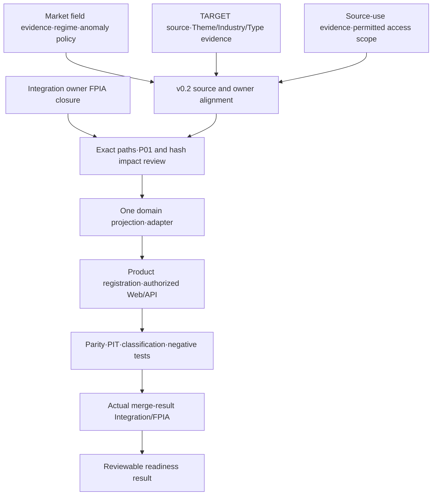

# ChartDocument v0.2 candidate review and Integration dependency · v0.3

Status: REVIEW_PROPOSAL_ONLY / PRODUCTION_SCHEMA_NOT_ADOPTED / IMPLEMENTATION_NOT_STARTED.

This additive record preserves PR #41 @ 54ee254, Audit baseline 8668c69, v0.1 design, v0.2 prerequisite checkpoint and Core 81 / Extended 24 / Research Candidate 8. It does not implement or activate a ChartDocument schema, change production/package Python or protected Web files, repin a digest, rewrite Frozen history, issue a grant, access Holdout or authorize canonical merge. Source and licensing conclusions are supplied by the separately scoped Market/GICS/Portfolio evidence audits; this document reviews their implications.

## 1. Candidate review

KEEP means the proposed responsibility remains. CHANGE means retain the responsibility but sharpen its evidence binding. DROP would mean redundant or unsafe; no candidate is dropped. Every field below is a proposed logical requirement, not an adopted field name/enum or numeric/publication policy.

| ID | Decision | Actual gap / counterexample | Additive v0.2 clarification |
|---|---|---|---|
| C01 Immutable payload / current authority envelope | KEEP | An immutable raw-price or target-composition payload can outlive its publication/invalidation decision; re-fetches can differ in adjusted-close tokens even while OHLCV matches | Hash immutable payload, exact raw bytes/request descriptors, input hashes, calculation/classification revisions and evidence only. Return a separately evaluated current authorization envelope for the exact payload subject, requested consumer/scope and decision time. Record hash preimage/schema-version references; do not hash a self-hash, collapse distinct captured revisions or mutate stored payloads after invalidation. |
| C02 Decimal raw value / owner execution / result | KEEP | Actual domain weights are Decimal; target reference uses its own float representation; ambient Decimal context and existing serializer rejection cannot be repaired by a string alone | Preserve authoritative input type/value, owner-produced outputs, calculation version/context and output hash. Display encoding/pixel conversion is separate. No chart-selected precision, rounding, epsilon, normalization, recomputation of financial totals or conversion to DEMO integer units. |
| C03 NOT_AVAILABLE / diagnostics / valid empty | CHANGE | ACTUAL input is absent; a TARGET exists; missing OHLCV and inconsistent candles remain in raw bytes; unavailable type membership is not an empty confirmed membership set | Capability-specific reason/affected range/fields; separate restricted diagnostic evidence from usable product results. Distinguish source absent, verified empty, known zero, partial classification and incomplete exact membership. A missing ACTUAL root cannot yield a zero-account result or TARGET fallback. Invalid candle rendering requires a proposed block/degrade/annotate policy, never silent data repair. |
| C04 Per-input source binding | CHANGE | A target allocation supplies weights without broker quantities; actual account/cash/valuation/FX completeness is currently not proved; projected market_value can lose original FX provenance | Independent TARGET and ACTUAL lineage roots and account scope; bind every position/valuation/FX/cash dependency when applicable. TARGET must not invent actual position/cash/price inputs simply to fit an ACTUAL shape. Preserve classification and valuation joins at the correct security/listing/issuer scope. A shared security across accounts is aggregated once by the domain, then projected once per authoritative exposure unit. |
| C05 Timestamp role / session / knowledge-access clocks | CHANGE | Five-year prices were retrieved later; bar timestamps, regular-market-close and quote timestamps do not establish historical available_at. Hanmi's CSAT-day timestamp differs from official session open; GEV pre-regular-way bars need a trading-regime join | Distinct provider raw timestamp, event/bar/session time, observed_at, ingestion time, provider available_at (UNKNOWN if absent), knowledge_time/cutoff, valid/effective period and revision. Bind listing/trading-regime effective interval, session/timezone/calendar version and source authority; declare exactly what each timestamp proves. Never promote a daily provider timestamp to actual market open. Retrieval only establishes observed access for that captured revision, never earlier knowability/finality. |
| C06 Catalog / assignment revision / completeness | CHANGE | Legacy 30/25/20/25 buckets are strategy allocation, not GICS; SIC/SICC/KRX remain separate; current GICS data cannot certify historical assignment | Separate Industry (explicit taxonomy plus hierarchy level), StrategyTheme (user/system-defined), InvestmentType (multi-label) and derived TypeOverlap view. Catalog version is distinct from per-subject assignment revision, effective period, available_at, evidence/methodology and membership completeness. Preserve source/licensing-use-scope binding when supplied by source owner. No implicit GICS crosswalk, manufactured GICS label, synthetic-to-production promotion or rule execution in renderer. |
| C07 Exact subject publication / invalidation | KEEP | Validation success and even live feed metadata do not authorize a Chart product; same document may be invalidated after caching | Reuse existing publication owner predicate and exact subject facts/hash/scope/decision-time/invalidation chain. API/Web/future MCP return the same authoritative value/hash for the same materialized document and consistent authorized scope; transport does not issue grants. Distinct captures need not have equal source hashes. Feed LIVE/DELAYED/CLOSE/UNKNOWN remains separate from Official/LIVE product status. |

## 2. Additional logical clarifications required by the four Portfolio views

These are subordinate clarifications of C03/C04/C06/C07, not new production semantics or an increase to the preserved Audit requirement count.

| Clarification | Why necessary | Proposed relation / proof obligation |
|---|---|---|
| Dimension and chart intent | “industry” currently names strategy buckets, and donut totals mean different things | Each requested view declares Industry taxonomy/hierarchy, StrategyTheme taxonomy or InvestmentType taxonomy. TypeOverlap is derived only from the exact complete InvestmentType membership set; it is not a fourth source taxonomy. Subject includes TARGET/ACTUAL basis, snapshot revision, dimension/catalog/assignment revisions and view level. |
| Weight measure / denominator provenance | A per-type exposure can exceed 100%; exact-combination buckets must conserve the chosen snapshot denominator | Projection records the authoritative snapshot measure and denominator reference, units, included/unclassified/cash scope and coverage, using domain-owner semantics. Do not infer a new denominator or normalize multitype exposures to 100%. Each holding/security exposure unit contributes once to its exact combination, after authoritative account aggregation. |
| Exact membership knownness | A source asserting Growth but silent about Quality does not prove the exact set is {Growth} | Preserve membership-set completeness. Known partial memberships may support explicitly partial type exposure if authorized, but cannot be presented as a complete exact-combination bucket. Unknown membership is not an empty confirmed set. |
| History capability separation | Current classification source may be valid today but have no PIT history | Current TARGET composition and quarterly/PIT history have separate capabilities/evidence gates. Do not reconstruct a historic assignment from today's catalog or infer available_at from effective_at. No historical source does not automatically block current TARGET theme composition. |
| Data/feed capability versus product publication | Provider metadata or classified TARGET evidence can be ready while grants remain NONE | Report source readiness, domain/projection readiness, rendering readiness and product publication independently. SOURCE_READY never means Official/LIVE or full chart completion. |
| C08 additive source-use evidence, separate from Product authority | Source licensing/retention/display/derived-use/API/MCP scope is not established by an internal publication grant | Preserve the source-rights evidence reference, permitted-use scope and unresolved use/retention/display/derivation/access states separately from the Product publication/invalidation envelope. Existing Product authority cannot replace source rights. This is an evidence/admission dependency proposal; it does not invent an entitlement, issue a grant or implement a new permission system. |

### 2.1 Actual Market and source-use findings applied to the proposal

| Observed evidence | What is confirmed / still unknown | Required contract implication |
|---|---|---|
| GEV Yahoo series contains three bars before 2024-04-02 regular-way trading; primary company evidence distinguishes anticipated GEV WI when-issued trading from 2024-04-02 regular-way GEV launch | Raw provider symbol GEV and bar existence are confirmed. Pre-launch bars are when-issued candidates; exact provider-to-listing/trading-regime binding is not proved merely by the company announcement | Bind effective listing/trading regime per bar/range, with original provider label preserved. Do not relabel the three bars, delete them or concatenate them into regular-way history by assumption. C04/C05 need dated source-join evidence. |
| Hanmi 2025-11-13 raw daily timestamp maps to 09:00 Asia/Seoul; official KRX KOSPI CSAT notice changes that day's regular session to 10:00–16:30 | The raw timestamp is not actual regular-session open on this date. The official session exception establishes schedule evidence; vendor daily timestamp meaning remains unconfirmed | Keep raw provider timestamp, session local date, scheduled/actual event roles and schedule exception separately. C05 cannot use timestamp=session-open as a universal fact. |
| Original 23,155 OHLCV rows are unchanged in the events-request comparison; 10,862 adjusted-close tokens differ exactly | Different request parameters and observation times; recorded cause UNKNOWN. Small source-value differences do not establish economic revisions, adjusted-OHLC semantics or a vendor defect | Preserve both immutable captures, request descriptors, exact tokens, source hashes and observation times. C01/C02/C05 retain revision/vintage identity and unknown historical availability; do not add a tolerance, replace original prices or assign a causal explanation. |
| GICS primary documentation exposes source-use constraints; authorized complete assignments/entitlement have not been admitted | Source rights are currently unresolved separately from Investment-System grants | C08 records use, retention, display, derived outputs and API/MCP audience/access scope as distinct source-evidence questions. Both source admission and Product authority must satisfy their own existing-owner gates; neither certifies the other. |

Source-agent evidence cross-checks: `../market-identity-time/gev_when_issued_extracted.txt`, `gev_regular_way_extracted.txt`, `krx_kospi_csat_2025_extracted.txt`; `../market-basis-anomalies/TWO_OBSERVATIONS_COMPARISON_v0.3.json` and `SOURCE_FIELD_COMPLETENESS_AND_DIFFERENCE_AMPLITUDE_v0.3.json`; `../gics/GICS_FEASIBILITY_AUDIT_v0.3.md` and its source register. These are additive observations within this new review; no prior v0.1/v0.2 evidence was changed.

Required object relation (proposal only):

`PortfolioSnapshot(TARGET or ACTUAL, revision, lineage, authoritative numeric outputs)`
→ `Position/Allocation projection`
→ source-backed `ClassificationAssignment[]`
→ one domain-owned `ClassificationExposure` projection:
Industry / StrategyTheme / InvestmentType / TypeOverlap.

A TARGET allocation entry need not pretend to be a broker Position with quantity/market_value. Source assignment and aggregation are separate; renderers consume the verified projection. Industry taxonomy/license/historical evidence and Type membership evidence may be unavailable independently while StrategyTheme target history remains available.

## 3. Fresh FPIA read: one exact head passed, gate remains open

GitHub read-only observations are recorded in `FPIA_FRESH_READ_EVIDENCE.json`.

- PR #42: [integration/fpia-hardened-v1](https://github.com/kco994553-star/Investment-System1/pull/42), Draft/Open, not merged.
- Head T: `523e702a806a718d163cfbf62aa3fc29d8c3ef3c`; base `integration/cdr012-successor-trial-2026-10-04` @ `acaf1b5a82859ac2750a130ebe88f8b4d272ac66`.
- [run 37234682864 / job 111531323882](https://github.com/kco994553-star/Investment-System1/actions/runs/37234682864/job/111531323882) completed SUCCESS.
- Actual job logs specify audit subject T=`523e702...` and CDR-014 register G=`9d9b2b2b942cfa6d1f7b296ad81d380ec6a70b3e`. This is the PR head, not the GitHub synthetic merge `0db0d3087ac1a0dff805348de060f23cae451a2d`.
- Summary: `FPIA_PASS`; `CODE_IDENTITY_DIVERGED` (code_hash R `0ef3a900` → T `df34b84f`); `FROZEN_TOOLS_ON_T_FAIL` as a separate verbatim BRANCH_FROZEN_VALIDATION class; `HISTORICAL_FROZEN_IDENTITY_PRESERVED` (4 records + 4 CI logs replayed, 27 byte-protected only); `TRACK_C_PROJECTION_PRESERVED`; `INTEGRATION_INTERFERENCE_NONE`; v2 binding and full regression PASS.
- Result hash `d85ecc4b4913b31efb61dc2417898d6a51f3d9f7398d9b17bce7f233d847c520`; log says `fpia-output: VERIFIED`; artifact 11315618718 uploaded. Chart audit has not downloaded or independently verified its complete artifact/side files.
- Tier 1/Tier 2 dedicated steps are SKIPPED for this pull_request event by workflow design; they are workflow_dispatch-only. This does not erase the separately reported full regression PASS. It also does not certify an independent adversarial review.
- PR body lists open decisions D3-a (trusted auditor version), D3-b (job-id spoof collision), D3-c (dynamic invocation non-claim), D3-d (#28 importer attribution). G7 integration-branch trigger interpretation is pending user confirmation. Independent adversarial/completeness review of fix round 2/head, GIE evidence recording and exact local CLI reruns at latest packaging head remain NOT_RUN in the body.
- Global handoff `9d9b2b2` retains GCH-014/GSI-020: hardened FPIA implementation/verification in progress. It does not yet contain a closure record for this latest successful run. CDR-014 continues to prohibit #17 digest repin, Frozen rewrite and canonical merge.

Readiness verdict: **TOOL_CI_VERIFIED_ON_EXACT_PR_HEAD / INTEGRATION_IMPLEMENTATION_GATE_NOT_CLOSED**. This is not a Frozen PASS, protected-change approval or approval to begin Chart production wiring. The future Chart + latest Integration tree still needs its own exact merge-result audit. This audit does not decide the Integration owner's open D3 proposals.

## 4. Exact implementation flags and owner boundaries

Flags are independent; no P01 or package-hash change is not equivalent to “no Integration/FPIA review”.

| Intended change / exact placement | Protected source | P01 seven-file digest | Track C whole-package code_hash | Necessary owner / validation gate | Execution in this stage |
|---|---|---|---|---|---|
| Add scoped Markdown/JSON/public raw evidence under `implementation/experiments/chart-contract-v0.1/p0-classification-review-v0.3/` | None | No direct impact | No direct impact | Source/evidence review; candidate-merge exact-tree review if included | Allowed |
| Offline deterministic read-only probes outside `implementation/src/investment_system/`, without invocation from owner workflows | None | No direct impact | No direct impact | Result limitations; future diff attribution/static FPIA check if landed | Allowed; not production certification |
| Classification source catalog / per-security evidence without adopting a taxonomy/rule/assignment | None | No direct impact | No direct impact | Source licensing/identity/PIT review | Allowed |
| New Market OHLCV/session adapter under `implementation/src/investment_system/` | Additive owner path required | No direct impact unless seven protected files change | YES, every `*.py` under package root participates | Market/Technical/Identity/Producer interface agreement; FPIA tool closure then exact resulting-tree FPIA plus owner regressions | Prohibited now |
| Decimal evidence adapter / Portfolio classification projection under package root | Avoid Frozen `personal/*` contract edits | No direct impact unless seven files change | YES | Personal/Producer/classification owner agreement; authoritative account/FX/context parity; FPIA readiness and exact result | Prohibited now |
| Registered Chart product/validator in a new package module | Producer owner path | Path-dependent; assembler edits YES | YES | Schema/product/publication subject registration plus exact-tree audit | Prohibited now |
| `implementation/src/investment_system/product/web_mvp.py` | Protected Web | YES | YES | Web + P01 + Integration; separately authorized digest path, no silent repin | Prohibited now |
| `implementation/src/investment_system/producers/assembler.py` | Protected assembler | YES | YES | Producer + P01 + Integration; separately authorized digest path | Prohibited now |
| `implementation/src/investment_system/product/web_assets/app.js` alone | Web-owner path | Not in the seven-file P01 digest; other guards must be checked | No direct Python hash impact | Schema/source/authorization parity and browser validation; owner route and exact Integration tree | Production wiring prohibited now |
| API / later MCP read transport | Depends on placement | Exact-path dependent | YES if package Python, NO direct if external only | Same materialized contract/hash/authorized scope/invalidation; source cannot be recollected and calculations cannot be repeated | MCP outside scope; production API after domain product gate |
| Frozen contract edit / grant / Official-LIVE / Holdout / canonical merge | Protected/decision boundary | Case-specific | Case-specific | Independent authorization, never inferred from FPIA PASS | Prohibited |

P01 exact source list at PR #42 head, `implementation/tests/test_p01_research_publication.py:429`:
`qgv/pipeline.py`, `qgv/leaderboard.py`, `qgv/book.py`, `technical/engine.py`, `macro/engine.py`, `product/web_mvp.py`, `producers/assembler.py`.
Observed pins are pre-adoption `1d6c56e4bcf356758ecec8c0524bf2a345eb99acd568278e0366599f3dd2f259` and C28-adopted `e6de46714f4405b52d4b25a418cc4081ff6df9d8891f332f59cc47e5ccc6c909`; neither is repinned here.

Whole-package hash code is `implementation/src/investment_system/evl/calibration_contracts.py:74`: roots at `investment_system`, sorted `rglob("*.py")`, hashing relative paths plus bytes. An empty new package Python file changes identity; moving adapters outside Track C but inside package does not avoid the effect. FPIA's current PASS does not turn divergence into SAME.

## 5. Implementation dependency

FPIA tool readiness before implementation and FPIA of the implemented exact merge-result are separate gates. Unavailable GICS/Type/ACTUAL capability remains unavailable; it does not force a fallback to TARGET or block independent current TARGET Theme evidence. Future MCP reads the same verified product; it is not implemented here. V/Reverse DCF/MOS/scenario-target semantics remain deferred to QGV reconciliation.

No new Chart numeric or assignment D3 is chosen by this document. Source selection/license commitment, classification rule adoption, protected repin, grant and canonical merge would each need their applicable owner/authority route if later requested; Integration D3-a/b/c/d are existing upstream decisions.
