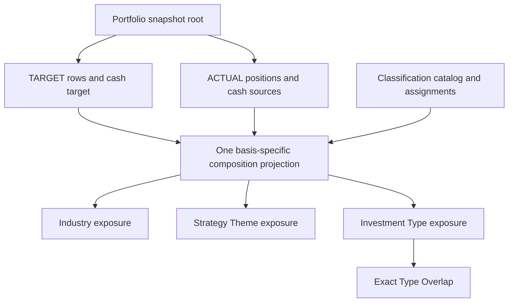

# Portfolio Classification Architecture Review v0.3

Status: **PROPOSAL / NOT_ADOPTED / IMPLEMENTATION_NOT_STARTED**. Audit and logical contract design only. This is additive to P0 Chart Contract v0.1 and prerequisites v0.2; no prior document, reference, assignment, Frozen contract, schema, production code, Official portfolio or publication authority is changed.

Pinned sources: Chart PR41 `54ee25446ccf6cfa32ddf164a8ed31b7e1036b9a`; independently inspected integration tree `523e702a806a718d163cfbf62aa3fc29d8c3ef3c`. Exact source blob and byte hashes are in `EVIDENCE.json`. These are read source pins, not authority to modify the integration branch. Core 81 / Extended 24 / Research Candidate 8 remain unchanged.

## 1. Findings and readiness

The existing reference contains 19 authored target rows, cash 0 and allocation buckets **30 / 25 / 20 / 25%**. Its `industry` field is the existing user allocation group, not a sourced industry taxonomy. Every reference `security_id` and `types` value is null, and classification `available_at` is null. Preserve these facts and the reference bytes. A successor projection should interpret the sourced grouping as **Strategy Theme / Portfolio Bucket**; it must not retroactively rewrite the old `industry` field.

Actual holdings remain **NOT_AVAILABLE**. Integrated `personal/portfolio.py` explicitly separates Model/Actual, supports BROKER or USER_ENTERED positions and Decimal account aggregation, but a dataclass or BrokerAdapter Protocol does not provide a real account source. The model-side `contracts.models.Holding.actual_weight`, including values copied from target weights by `qgv/portfolio.py`, is not actual account evidence. The two integrated Web `actual_weight ?? target_weight` expressions remain unresolved owner work.

| Requested TARGET view | Source evidence today | Production readiness | Independent blocker / prerequisite |
|---|---|---|---|
| GICS Industry Exposure | No admitted legal company/security assignment dataset in the inspected chart evidence | **NOT_AVAILABLE / BLOCKED** | GICS source/licensing review, assignment binding, catalog/revision/effective/availability facts, independently validated target root |
| Strategy Theme Exposure | 19-row authored reference; exact four buckets and weights available | **PARTIAL**; reference semantics/source ready, production product not ready | Provenance-backed TARGET producer/root admission, explicit strategy-scoped grouping binding, current-use time evidence, Decimal/float preservation, product registration/authority |
| Investment Type Exposure | Reference catalog labels exist; all 19 membership sets unresolved | **NOT_AVAILABLE / BLOCKED** | Methodology/version and source-backed assignments, membership completeness, admissible target root |
| Type Overlap | Derived from complete Type membership, no separate source | **NOT_AVAILABLE / BLOCKED** | Same Type assignments/completeness; single shared projection and conservation verification |

No requested production view is certified READY by this document. ACTUAL absence does not block independent TARGET work. Quarterly history absence does not block an otherwise admissible current TARGET composition. GICS/Type unavailability does not block the sourced TARGET Theme reference or prospective independent Theme product path. Missing publication authority remains separate from source/math readiness.

GICS audit is owned by the source/licensing review and is not duplicated here. GICS hierarchy and display level are proposed product design, conditional on lawful source-backed assignments. SEC SIC / JPX SICC / KRX KIND remain explicitly named alternatives, never renamed GICS or silently combined into one multinational partition. A crosswalk would require separate source, method/version, temporal validity and validation; none is approved or authored here.

## 2. Four questions, four dimensions

| Dimension | Question answered | Classification scope | Suggested display; proposal only |
|---|---|---|---|
| Industry (GICS if admitted, otherwise explicitly named taxonomy) | Which economic industry categories carry this portfolio's target or actual capital? | Assignment source declares issuer/company/security granularity; reviewed join to snapshot subjects required | Sector first; Industry Group → Industry → Sub-Industry drill-down, one consistent catalog/revision selection per view |
| Strategy Theme / Portfolio Bucket | Which parts of this user's strategy receive the planned or held allocation? | Strategy/portfolio-specific assignment, not a universal property of a company | Separate four-bucket composition for the current authored target; show portfolio/strategy version |
| Investment Type | How much of the same portfolio base is exposed to each investment characteristic? | Source-backed subject membership set and versioned methodology | Type-by-type exposure values and independent donut/ring versus non-membership/unknown/cash; never a normalized pie of summed memberships |
| Type Overlap | Which exact combination of investment types describes each portion of the portfolio? | Derived from the same complete Investment Type set | Disjoint exact-combination buckets with explicit unknown/known-empty/cash states |

The existing Korean labels `반도체 장비 / AI·반도체 / Big Tech / 기타산업` remain authored strategic allocation groups even when individual names resemble industries. `기타산업` contains authored holdings, not a residual GICS sector. The old group weights and company memberships are preserved.

`StrategyTheme` and InvestmentType's existing label `Theme(테마)` use distinct namespaces and concept IDs. A type label Theme does not grant membership in AI·반도체, Big Tech or any strategy bucket. A multi-type assignment does not authorize multi-theme assignment. The present authored target buckets are a single partition; future multi-theme membership, attribution or fractional allocation policy is **UNDECIDED**, not silently normalized or implemented.

## 3. Logical object relationships

Names below are semantic proposals, not an active JSON/Python schema or amendments to Frozen `personal` dataclasses.

A root is **one** basis with one admitted source/snapshot/knowledge scope. A response may reference two independent roots side-by-side; no root, denominator, position list or source lineage mixes TARGET and ACTUAL.

- `PortfolioSnapshotRef`: exact upstream snapshot ID/hash/version, portfolio/strategy/policy/calculation refs, basis, source origin, data_as_of, knowledge cutoff, acquisition/availability evidence, completeness and numeric execution refs. Preserve upstream values and source role. `REFERENCE_FIXTURE` is not an implicit production TARGET or account snapshot.
- `TargetAllocationRow`: existing company/security namespace and immutable source row key, owner target weight, target cash, strategy group assignment refs. Do not manufacture quantities, market values, prices, FX or accounts to fit an Actual Position shape. A user-authored company-scoped Theme view can preserve company references without claiming a resolved exchange listing; security/listing-based Industry/Type joins remain independently unavailable until evidenced.
- `ActualPositionEvidence`: upstream Position ref, account/security ID, quantity/market value, position/price as_of, BROKER/USER_ENTERED source, original valuation and money/FX/conversion provenance. Cash needs its own source/account/time linkage; tuple order cannot invent one.
- `ClassificationCatalogRef`: dimension, namespace, owner/source/methodology, catalog/taxonomy version/revision, labels/hierarchy, validity and acquisition/availability evidence. Catalog existence does not classify companies.
- `ClassificationAssignmentRevision`: subject namespace/ID and granularity, catalog ref, assignment/membership set, source row/artifact/hash, method/rule/version, strategy scope where relevant, effective interval, source availability and availability evidence, revision/supersession ref, completeness and applicable confidence/evidence facts. No confidence values or methodology cutoffs are invented.
- `ClassificationExposure`: upstream root ref, exact catalog/assignment selection, projection version/hash, source/denominator/numeric context refs, coverage and capability assessment, aggregated amounts/weights, explicit cash/unknown/unassigned/known-empty categories. Financial aggregation occurs once in the shared domain/product projection; renderers consume its output.

Assignment production and chart aggregation are separate. Renderer/API/MCP cannot assign industry or infer growth/quality from a company name, ticker, sector, QGV score, provisional policy, synthetic fixture or search metadata. QGV raw scores remain immutable; V/scenario/MOS reconciliation is not a prerequisite for current authored strategy-bucket evidence.

## 4. Denominators and numeric preservation

Every view carries the exact basis and denominator ref; one complete portfolio base is reused across Industry, current single-partition Theme, each Type exposure and Overlap. Do not recompute percentages from rounded display labels.

**TARGET.** Consume the authoritative target weights and cash from the admitted upstream target output, with its validation and numeric contract. Existing generic target values are floats; preserve the declared original type/value and owner result. The reference's authored integer units are reference-only and are not a production Decimal adapter. Do not enforce a new chart-selected tolerance, round into 10,000 units, renormalize incomplete/invalid target totals or replace target weights with market value weights.

**ACTUAL.** Reuse `ActualPortfolioSnapshot.total_value()` and `.weights()`: positions for the same security across accounts aggregate once; denominator includes all position values and cash in the stated base currency. Preserve Decimal authoritative values/results and owner execution context. `.weights()` can still calculate from incomplete inputs and returns `{}` for a nonpositive total; neither case is evidence of valid empty/zero exposure. Account completeness, cash completeness, price/FX availability and eligible denominator must pass separately.

FX provenance is not automatically retained when `ConvertedMoney.converted` is placed in `Position.market_value`. Carry original Money, exact FX quote and available_at, conversion result/context, valuation source and source row refs in an additive evidence sidecar; do not edit Frozen Money/Position now. Money or decimal-string encoding alone does not prove finiteness, reproducible rounding context or admissibility. Source values stay authoritative; formatting and pixel coordinates do not create financial data.

Cash is not an industry or investment type. It may be an explicit partition bucket on the same whole-portfolio base. Unknown or unmapped classification is not cash and not a zero exposure. An explicitly requested securities-only view would have a separate declared denominator and product capability; it is not selected by this proposal.

## 5. Type membership and exact overlap

Investment Type supports multiple memberships. For each type, sum each eligible subject's authoritative weight once if its complete membership set contains that type. The same weight may legitimately appear in several Type exposures; their total can exceed 100%. Never normalize the sum of all type memberships or describe it as total portfolio value.

Type metadata distinguishes: complete known set, complete known empty set, incomplete/partial set, unresolved set and cash/not-applicable. A missing or partial set cannot become `[]`; a known label does not prove the rest of the set is absent. Industry missing, strategy bucket unknown and Type missing are independent coverage dimensions. A diagnostic partial view may preserve known/unknown weights, but cannot be certified complete/READY by reclassifying unknowns or excluding them from its denominator.

Overlap is derived from Type membership, not independently classified. Its bucket identity includes the Type catalog namespace/version and canonical **set** of exact concept IDs within one explicit document-wide methodology/classification selection. Individual per-subject assignment revision IDs remain provenance, not extra bucket dimensions: two subjects with the same exact set must aggregate together. Incompatible catalog/methodology selections require an explicit compatible selection or a blocked/partial result, not an unapproved merge. Localized labels do not form keys. Duplicate memberships are invalid or explicitly diagnosed; insertion order cannot create a new combination.

1. Reuse the upstream aggregated security/holding weights for the exact basis/scope. Each admitted aggregation unit enters one bucket once. Actual accounts contribute through upstream aggregation; classification at one coherent cutoff applies to the resulting security. Conflicting or differently scoped assignments require resolution, not duplicate buckets.
2. A complete `{Growth, Quality, Leader}` set enters only that exact bucket. It is not also placed in `{Growth, Quality}`, Growth, Quality or Leader buckets.
3. Unknown and partial membership enter distinct diagnostic/unknown buckets and cannot advertise a verified exact set. A complete empty set can be shown as `No assigned Type`, distinct from unknown. Cash has its own bucket.
4. Complete supported long-only denominator/coverage must conserve the upstream portfolio total across disjoint combination/empty/unknown/cash categories. No chart-selected precision/tolerance is introduced; the domain owner defines authoritative arithmetic and verification.

Illustrative semantics only, no real company assignment: a 0.40 synthetic weight with Growth+Quality+Leader and a 0.30 weight with Growth+Quality produce Growth exposure 0.70, Quality 0.70, Leader 0.40 (sum 1.80), while exact Overlap has those two buckets 0.40 and 0.30 plus other/unknown/cash 0.30. The illustration is not production data, a QGV classification rule or investment advice.

Signed/short positions, leverage, incompatible denominator or assignment conflicts are unsupported capability gaps requiring owner policy; a chart must not silently take absolute values or force a 100% partition.

## 6. Time, revisions and current versus historical use

Keep portfolio effective as_of, classification effective interval, source publication/available_at, local observation/acquisition, generation and knowledge cutoff distinct. For a requested date and knowledge cutoff, both subject-date validity and input knowability must be supported. A catalog revision date, portfolio version date, Git commit time or latest extraction clock is not automatically the original assignment available_at.

A captured current source can establish this capture was known at its observed time; do not backdate it. When original effective/publication facts are unknown, preserve UNKNOWN and qualify the supported current-source capability; do not claim historical decision replay. Source licensing/history restrictions apply independently.

A current TARGET Theme view needs its own admitted current target and strategy-assignment facts. It does **not** need old quarterly account snapshots, historical prices or historic GICS availability. A historical quarter/PIT view additionally needs immutable target/actual inputs and classifications/valuations/cash/FX admissible at the original cutoff. Freshly fetched current holdings or classifications cannot prove old composition. Historical target references exist in authored spec/Git, but no source-backed sequence of admissible past classification/target revisions is certified here. Append new snapshots/revisions rather than rewriting preserved history.

## 7. Publication and consumer behavior

Immutable exposure payloads retain root/calculate/source/classification lineage. A mutable authority envelope evaluates access/publication/invalidation for the exact subject hash, consumer/private-account scope and current decision time. Data validation cannot issue grants or imply Investment-System Official/LIVE. No PUBLIC, LIVE or research-display entitlement is invented.

API/Web and future MCP consume the same verified product/projection and authorized root. Same root/version/cutoff/classification selection yields the same value/payload/hash; a refreshed source has a new provenance/hash. Transport wrappers must not choose fallback data, recalculate weights, infer classifications or escape invalidation. ACTUAL NOT_AVAILABLE is returned independently even when a TARGET reference is present.

## 8. Protected and owner dependencies

| Planned activity | Protected edit | P01 digest | Package Python code_hash | Required owner / audit |
|---|---|---|---|---|
| This additive architecture/evidence document | None | No direct impact | No direct impact | Candidate integration exact-tree review still applies |
| Source-backed Theme/catalog/assignment evidence outside production package | None; no adoption implied | No direct impact | No direct impact | Source/target owner validation, provenance/semantic review |
| Shared TARGET/ACTUAL composition projection or Decimal/evidence adapter in package | Owner placement required; do not edit Frozen personal source | Recheck exact file paths | **Impact** | FPIA tooling readiness then exact merge-result FPIA/regression; upstream parity |
| Chart producer/validator registration | Producer/Web owner boundary | **If protected assembler/validator touched** | **Impact if package Python** | Exact affected paths/digest approval process and FPIA |
| Remove integrated Web actual/target fallback and wire dimension-specific views | Web owner task, not this branch | JS currently outside seven-file P01 digest; other Web guards still apply | JS alone no direct package-Python impact | Web/schema/source/publication-negative/browser + exact integrated tree review |
| GICS or Type assignment adoption / crosswalk / numeric policy | Not authored here | Placement-dependent | Placement-dependent | Source rights/methodology/owner decision before production use |

FPIA PASS, if achieved elsewhere, is not permission to change Frozen contracts or implement this proposal automatically. Source readiness, owner placement and exact candidate/result validation remain separate. No package/Protected Web work is performed in this review.

## 9. Executable non-protected prerequisites

Now: preserve and recheck 19 reference/source hashes; record exact target Theme grouping evidence; create additive catalog/assignment *evidence descriptions* without declaring production adoption; prepare negative-case admission examples for target/actual separation, partial Type membership, catalog conflicts, unknown/empty/cash, multi-account conservation and Decimal preservation. Investigate legal GICS/alternative sources in the separately owned audit. These are docs/diagnostics, not active schema/validator or threshold selection.

Later: target-owner validated root → explicit Theme/Industry/Type evidence selection → owner-approved shared composition projection and lossless numeric/evidence adapter → producer/publication registration and protected Web correction → source/parity/PIT/negative/browser checks → exact-result Integration/FPIA → same verified product API/Web; future MCP only reads that product.

## 10. Decisions and limitations

No new user approval is needed to complete this read-only/additive evidence review. The user has requested Industry/Theme/Type separation as a design direction; actual GICS license purchase, assignments, crosswalk, numerical policies, Frozen amendments and publication adoption remain unapproved and unperformed. Sector-default/drill-down is a proposal, not an activated product choice. Future multi-theme semantics are unresolved and outside this increment.

This review adds no production schema or tests. All runtime/production checks, Actions, browser validation and FPIA for a resulting implementation are **NOT_RUN**. Prior reference tests are not promoted to production certification.
