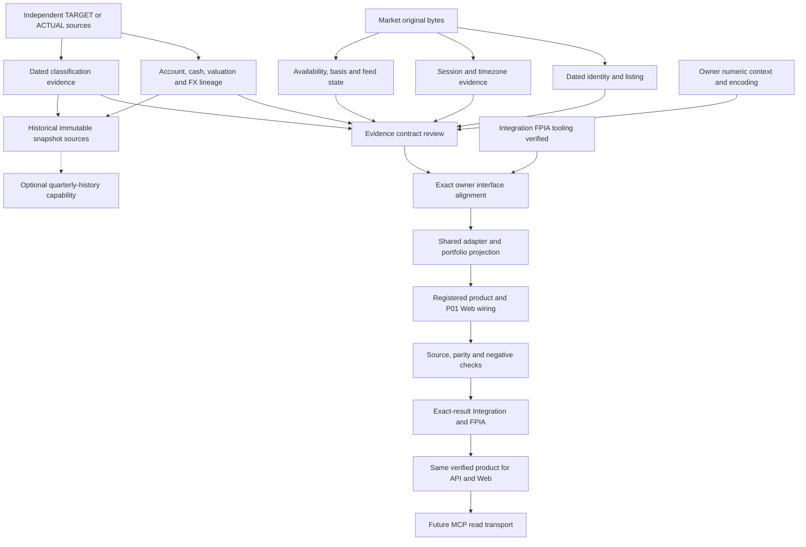

# P0 implementation prerequisites · evidence checkpoint v0.2

Status: EVIDENCE_REVIEW / SCHEMA_CORRECTION_PROPOSED_NOT_ACTIVE. Market/Portfolio production adapters and ChartDocument implementation remain NOT_STARTED. This is an additive prerequisite record; it does not supersede or edit P0 design v0.1.

## 1. Fixed baseline and authority

| Item | Fresh-read pin / meaning |
|---|---|
| PR #41 baseline | `97685ddcfb510fe16c2260eae5aed94be230c669`, Draft/Open |
| Preserved chart audit | `8668c69070c7956cb85d1ccf8cbeb8d9d2daf5cf` |
| Preserved scopes | Core 81 / Extended 24 / Research Candidate 8; no item or verdict rewritten |
| Canonical | `b8e39a2196a6d7794a04a0cd5393c68329e126ca` |
| Integrated source inspection | PR #40 `acaf1b5a82859ac2750a130ebe88f8b4d272ac66`, NON_CANONICAL |
| Global routing | `bb4cb174fd4a0af3b2281d4c37ae3abb4d540f88`, GCH-014 / GSI-020 |
| Integration gate | CDR-014 hardened FPIA approved; GCH-014 records IN_PROGRESS. Final fresh-read also found Draft PR #42, `integration/fpia-hardened-v1` @ `dc0bf792c4d10ac4e2ab8545d45003f7a59922f0`, with Actions IN_PROGRESS. Earlier PR40 CI and the presence of FPIA code are not completed FPIA acceptance |
| Current grants / promotion | No grant issued, no Official/LIVE upgrade, no canonical merge |

사용자 지시대로 protected Web validator/assembler, package-level production Python, Frozen source/evidence를 수정하지 않았다. 현재 작업은 public/source evidence 수집, 기존 계약의 read-only 확인, evidence 대입에 의한 logical-schema 적합성 점검 및 후속 구현 경로 분류다. v0.2는 제안이며 adopted schema나 새 상태 enum이 아니다. V/Reverse DCF/MOS/scenario-target은 QGV reconciliation 의존성을 유지한다.

## 2. Readiness verdicts

| Requested result | Evidence-based verdict | Remaining prerequisite |
|---|---|---|
| Market source readiness | 19개 provider symbol의 무계정 5년 범위 요청이 모두 HTTP 200. 23,155행 중 1행 전체 결측, 4행 OHLC envelope 불일치; 23,150행은 complete+envelope-valid. 종목 식별·세션·PIT 적격성은 아직 미확인 | dated security→listing→provider crosswalk, exchange-issued dated session vintage, revision availability, adjustment/action basis, quote state |
| Portfolio actual-data readiness | **NOT_AVAILABLE** — 저장소에서 확인되는 Actual 생성 경로는 테스트 fixture; BrokerAdapter는 Protocol | source-backed position/cash/account-scope snapshot, position/valuation/FX evidence binding 및 information-availability history |
| Target readiness | 기존 model/target/reference 입력 및 투자자 지정 grouping은 존재 | authoritative target validation, source/version/effective/available-at를 연결한 immutable target snapshot. 실제 보유분으로 재표시 금지 |
| Classification readiness | 공식 산업분류 source 후보 확인; 실제 assignment/history feed 연결은 미완료. 유형은 별도 evidence ledger 후보 | taxonomy와 assignment 각각의 namespace/version/hash/effective period/available_at, entity mapping, completeness |
| Quarterly snapshot readiness | 대상별 immutable snapshot 개념은 존재; source-backed personal quarterly history는 확인되지 않음 | 당시에 존재한 position/target/FX/classification revision refs를 함께 보존한 history. 현재 portfolio를 과거로 복제하지 않음 |
| ChartDocument v0.1 adequacy | 보존·분리·fail-closed 철학은 충분. concrete wire schema/validator로 실행 가능하거나 production-ready한 상태는 아님 | evidence 기반 v0.2 proposal의 구조·연결 사항을 owner가 검토하고 이후 등록/구현 |

Source-readiness 판정은 이 GitHub checkout과 이번에 보존한 public acquisition 범위다. 외부 계좌·미제공 개인파일에 holdings가 없다고 주장하지 않는다. 실제 원본의 현재 확보는 과거 시점의 이용 가능성을 증명하지 않는다. 기존 75개 test/browser 결과를 새 production PASS로 승격하지 않았다.

## 3. Material evidence and corrections

**Market.** Canonical `raw` 아래 최신 manifest가 있어도 원본 blob/history bytes가 없는 경우 historical replay를 할 수 없다. 원본 존재 여부와 manifest provider를 따로 검사해야 한다. Yahoo로 명명된 일부 record는 실제로 Tiingo close-only 변환 결과다. 이번 신규 수집은 기존 `fetch_real_data._get` 경로를 이용한 별도 current-source acquisition이며 과거 vintage의 복원으로 취급하지 않는다.

| 이번에 확보한 current-source 범위 | Rows | 실제 반환 기간 |
|---|---:|---|
| ASML, LRCX, KLAC, NVDA, AMD, AVGO, QCOM, INTC, MSFT, GOOGL, AMZN, RTX, SYK, ETN, HUBB, ROK | 각각 1,255 | 2021-10-04~2026-10-02 |
| GEV | 632 | 2024-03-27~2026-10-02 |
| 8035.T, Tokyo Electron label | 1,222 | 2021-10-04~2026-10-02 |
| 042700.KS, Hanmi label | 1,221 | 2021-10-05~2026-10-02; 2025-09-19 OHLCV 전부 null |

17개 미국 provider label은 기존 identifier 경로를 사용했고, 일본·한국의 2개 provider label은 탐색적 확보 표본이다. source 응답의 label/name는 security/listing binding을 인증하지 않는다. 전체 Top500, 분봉·실시간, 최초 상장 이후 전체 history를 검증한 것도 아니다. 원본 hash/길이/order/array alignment는 확인했지만 Tokyo 2022-05-17과 Hanmi 2024-01-15·2024-10-14·2025-04-09는 close가 high/low 밖에 있다. 원본을 수정·삭제·반올림해 통과시키지 않았으며 이 4행은 candle admission의 실패 사례로 보존했다.

bar timestamp, exchange session end, provider quote timestamp, acquisition start/end, persistence time 및 historical `available_at`은 독립된 사실이다. Yahoo의 현재 `currentTradingPeriod`는 5년 전 세션의 권한 있는 calendar가 아니다. 일본 거래 종료시간 변경과 한국 공급자 metadata/거래소 규정의 충돌은 이를 보여주는 실제 반례다. 시간대는 current UTC offset만 보존하지 않고 IANA zone와 tzdata/calendar vintage, 날짜별 segment 및 source/conflict 근거를 함께 연결해야 한다. 장 마감만으로 finality나 공급자 availability를 확정하지 않는다.

raw quote와 adjclose가 함께 있어도 전체 OHLCV의 unadjusted/adjusted transformation을 인증할 수 없다. 개별 split/dividend event의 effective date와 announcement/information availability, event coverage와 transformation methodology는 별도 근거다. quote-state를 polling frequency, 시장이 닫혔다는 사실, 제품 LIVE 상태에서 추정하지 않는다. UNKNOWN은 유지한다.

**Portfolio.** `ActualPortfolioSnapshot.weights()`가 동일 security의 여러 account 값을 합치고 cash를 포함한 denominator로 Decimal 비중을 계산하므로 이를 재사용한다. `ConvertedMoney`의 원금액/FX provenance가 `Position.market_value: Money`에 저장될 때 자동 보존되지는 않는다. snapshot-level source URL만 붙이면 손실이 복구되지 않는다. additive evidence record로 position, valuation, original Money, FX quote 및 conversion result를 authoritative domain output에 연결해야 한다.

target와 actual은 독립된 product다. model-side `actual_weight`라는 이름이나 `actual_weight ?? target_weight` 표현을 BROKER actual의 근거로 사용하지 않는다. 실제 holdings가 없으면 ACTUAL의 공개 결과는 NOT_AVAILABLE이며 TARGET/reference는 자체 origin/basis를 보존한다. unknown account/cash, missing price, missing FX, unsupported nonpositive/signed denominator, known-empty portfolio는 서로 다른 상태·사유를 갖는다. 화면에서 이를 0이나 empty array로 바꾸지 않는다.

**Decimal.** 문자열 인코딩만으로 계산의 재현성이 보장되지 않는다. 기존 domain 계산은 ambient Decimal context에 의존할 수 있으므로 동일 입력으로 반복소수 비중의 결과가 달라질 수 있다. 소유자가 계산한 결과와 당시 context/계산 버전을 보존해야 한다. 이 checkpoint는 precision/rounding/tolerance를 선택하지 않는다.

**Classification.** SEC SIC, JPX/SICC, KRX의 업종 source를 서로 같은 taxonomy로 합치지 않는다. catalog의 version과 assignment revision의 version은 다르다. current issuer metadata는 과거 assignment availability의 근거가 아니다. 기존 Semicap/AI/BigTech/Other는 USER_ALLOCATION_GROUP이며 표준산업으로 명칭을 바꾸지 않는다. 유형은 versioned catalog와 evidence-backed complete membership set이 별도로 필요하며 QGV threshold로 임의 생성하지 않는다.

산업 donut의 single partition, 개별 type exposure의 공통 portfolio denominator, exact-set Overlap의 disjoint partition은 v0.1대로 유지한다. multi-type exposure 합계는 100%를 넘을 수 있다. Overlap의 key는 taxonomy/catalog namespace·version과 정확한 정렬 membership set을 함께 식별하며 각 aggregated holding은 한 번만 집계한다. unknown과 known empty set, cash는 별도 bucket이다.

## 4. Required v0.2 proposal

Detailed adversarial assessment and correction rows: `contract/`. No JSON Schema, validator or runtime adapter is implemented.

| Proposal | Evidence driving it | Proposed requirement, not active schema |
|---|---|---|
| C01: immutable payload/hash boundary | invalidation may change after the materialized payload is hashed | immutable ChartDocument payload/hash와 mutable response envelope 및 self-hash preimage를 구분. 원본 provenance는 immutable subject 안에 보존 |
| C02: numeric execution binding | Decimal context 차이, serializer Decimal rejection | upstream authoritative numeric type/value, owner calculation/version/context/materialized-output hash를 연결. 임의 precision이나 normalization 없음 |
| C03: unavailable result vs diagnostics | 실제 source 없는 Actual, 결측 1행·OHLC 불일치 4행, 미해결 join | NOT_AVAILABLE product result와 restricted diagnostics를 구분. range/field/capability 사유 보존; empty/zero 또는 고친 candle로 변환하지 않음 |
| C04: per-input dependency graph | position·valuation·FX의 provenance 손실, account/cash source missing | source-backed per-input/account-scope/completeness·conversion refs 및 TARGET/ACTUAL 별도 root lineage. artifact ID만으로 latest bytes를 대체하지 않음 |
| C05: time facts and decision clocks | JPX close change, KRX source mismatch, US-only binder, provider availability unknown | dated session segment/schedule/calendar/tz/authority/conflict 근거; bar/revision/finality와 source available-at의 역할 및 knowledge/access clocks 구분 |
| C06: classification identity and coverage | SIC/SICC/KRX namespace와 assignment history의 차이 | catalog namespace/version + assignment revision + source availability + effective period + membership completeness + join evidence. 승인되지 않은 crosswalk 금지 |
| C07: exact subject lifecycle/access binding | source 검증만으로 grant/invalidation이 충족되지 않음 | existing-owner eligibility/authorization/invalidation을 exact subject와 decision time에 연결. API/MCP 동일 scope/decision parity; grant 발행 없음 |

v0.1이 이미 선언한 안전 원칙을 새 proof obligation과 구조적 field grouping으로 구체화하는 제안이다. 새로운 투자 계산식·type assignment·confidence cutoff·TTL·numeric default·publication rule을 정하지 않는다.

## 5. Concrete implementation path classification

Flags are independent. “P01 영향 없음” does not mean “Integration 검증 불필요”. 새 문서/fixture도 기존 Track C closed-world acceptance와 충돌할 수 있어 canonical 후보에 포함된다면 해당 exact tree의 FPIA가 필요하다.

| Work item / intended placement | Protected source change | P01 protected digest | Track C package code_hash | Integration / FPIA | Execution now |
|---|---|---|---|---|---|
| scoped evidence reports, source catalog, raw public captures in this experiment | 없음 | 없음 | 없음 | candidate merge 시 필요; 지금 exact-merge FPIA NOT_RUN | 허용, 이번에 수행 |
| read-only/offline raw hash·coverage·calendar/source-conflict probes outside package | 없음 | 없음 | 없음 | committed changes included in candidate → exact-tree review | 허용; production 인증으로 확대 금지 |
| evidence-backed identity/listing/classification source records, without adopting an assignment/policy | 없음 | 없음 | 없음 | source/provenance review; committed candidate에는 FPIA | 독립 진행 가능 |
| Market full-OHLCV/session adapter in `src/investment_system/*` | additive일 수 있으나 owner 경로 승인 필요 | 직접 없음, 변경 파일별 재확인 | 영향 있음 | FPIA tooling/owner gate 후 구현; 결과 tree에서 재검증 | **지금 금지** |
| Portfolio Decimal/evidence adapter and one composition projection in package | additive owner path 필요; Frozen personal 파일 수정 회피 | 직접 없음 | 영향 있음 | 위와 동일; domain parity·multi-account/FX/context 검증 | **지금 금지** |
| chart sidecar registration/producer validator in package | producer-owner alignment 필요 | exact path에 따라 다름; assembler 변경 시 영향 | 영향 있음 | interface acceptance + exact-result audit | **지금 금지** |
| `product/web_mvp.py` validator / `producers/assembler.py` | 보호 파일 변경 | **영향 있음** | **영향 있음** | Web/Producer/P01 owner 승인 경로 및 별도 digest 조정, exact-tree FPIA | **지금 금지** |
| `product/web_assets/app.js` basis-specific renderer wiring | Web owner 경로 | 현재 seven-file digest에는 포함 안 됨; 다른 guard 별도 확인 | JS만이면 직접 없음 | source/schema/publication-negative/browser + exact-result audit | production 연결은 dependency 이후 |
| API / future MCP thin read transports | placement에 따라 owner 영향 | exact files에 따라 다름 | package Python이면 영향 | same payload/value/hash; same authorized scope; invalidation parity | verified product 경로 이후 |
| grant issue, Official/LIVE, Frozen edit, canonical merge | 별도 권한 경계 | 관련 보호 재검토 | 변경별 판단 | FPIA만으로 승인되지 않음 | **금지, 수행 없음** |

현재 P01 digest 대상은 `qgv/pipeline.py`, `qgv/leaderboard.py`, `qgv/book.py`, `technical/engine.py`, `macro/engine.py`, `product/web_mvp.py`, `producers/assembler.py`이다. `evl/calibration_contracts.code_hash()`는 package 아래 모든 `*.py`를 hash한다. 새 adapter를 Track C 폴더 밖에 두어도 package identity는 바뀐다. 위 분류는 실제 diff가 생기면 다시 확인한다.

## 6. P0 dependency graph

Graph is a design/source dependency map, not a record of completed runtime wiring. FPIA tooling readiness before implementation and FPIA audit of the resulting exact tree after implementation are distinct gates.

기존 publication authority는 W·R 모두에서 별도 조건으로 적용한다. grant가 없거나 invalidated이면 값이 검증됐더라도 허용된 NOT_AVAILABLE/withheld 결과를 반환한다. 위 graph는 grant 발행 또는 투자용 LIVE 상태를 승인하지 않는다. ACTUAL source가 없어도 TARGET 계약의 독립 source 작업은 계속할 수 있다. 현재 composition에 필요한 dated classification과 추가 quarterly-history capability에 필요한 과거 immutable source는 별개이며, 분기 history 부재가 현재 TARGET composition의 필수 blocker는 아니다. V/QGV reconciliation은 별도 valuation chart 경로의 dependency이며 P0 composition evidence를 막지 않는다.

## 7. Next executable work and verification meaning

지금 가능한 non-protected 작업은 원본·manifest byte hash 재생, 기존 explicit provider symbol의 확보범위 조사, dated listing/session/calendar/source 후보 및 충돌 근거 수집, assignment/catalog/quarter history source의 gap catalog, source-backed diagnostic fixtures와 planned admission cases 준비다. 현재 source acquisition과 historical PIT source restoration을 별도로 관리한다. 실제 계좌 연결·개인정보 요청 없이 없는 actual을 만들지 않는다.

FPIA tooling이 실제로 검증되고 owner 경로가 정렬된 뒤에만 package adapter/projection/registration과 protected product 연결을 시작할 수 있다. 이때도 source가 미충족인 capability는 unavailable이어야 한다. 구현한 뒤에는 대상 exact tree에서 source replay, domain value parity, PIT negative cases, Decimal context/value 보존, TARGET/ACTUAL 전환, overlap conservation, grant/invalidation-negative cases, browser 및 영향을 받는 regression/FPIA를 수행한다.

이번 evidence checkpoint의 완료 기준은 source readiness·actual readiness·classification readiness·v0.1 adequacy·v0.2 proposal·non-protected/after-FPIA work·dependency graph와 baseline preservation이다. 실행하지 않은 production tests, Actions, FPIA는 NOT_RUN이다. source/evidence completeness를 chart completion percentage로 환산하지 않는다.

Related artifacts: `market/`, `portfolio/`, `contract/`, `root/source-pin-replay.json`, and the final `root/verification.json`. Source evidence and review findings remain additive to all prior v0.1 records.
