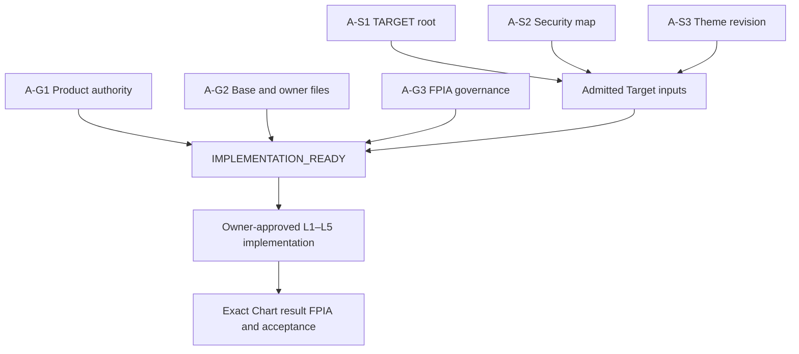

# Chart P0 owner closure delta v0.5

**Target Theme IMPLEMENTATION_NOT_READY: 6 OPEN / 0 CLOSED. Market admission 0/19, 8 evidence families remain.** This bounded checkpoint takes over the already-published v0.4 at PR41 `d93c7ace37603d91f1d9342152c97e8acb3d4e8c`. It supplies concrete owner-return packets and repairs scoped handoff routing. It does not repeat the broad audit, add requirements, adopt a schema or implement production code.

## What is now concrete

| Existing gate | New bounded evidence / owner return | Verdict |
|---|---|---|
| A-S1 current TARGET root | Exact19 reference row keys/weights/source pins plus a fillable immutable root/applicability/completeness/denominator receipt | OPEN; reference is not an admitted current root |
| A-S2 Security scope | Common identity/resolver capability pinned; reviewed company→security/share-form fields are null in the19-row owner request | OPEN; no IDs invented |
| A-S3 Theme catalog/revision | Four user-defined Theme relations preserved; catalog/assignment revision/effective validity owner-return fields explicit | OPEN; observed labels are not an adopted catalog |
| A-G1 Product/interface/authority | Actual existing serializer accepts tagged decimal strings losslessly. Chart extractor/API/current TARGET authority route absent; P01 research-display applicability is explicitly an owner question | OPEN; no new seventh gate or grant requirement inferred |
| A-G2 Base/write-set/ownership | Existing build copies new independent HTML/JS/CSS. A standalone Target page can avoid validator/assembler and cockpit navigation changes; exact host/read mount remains owner selection | OPEN; unchanged protected digest is not an authority bypass |
| A-G3 FPIA governance | Fresh PR42 actual7 workflows green at523e702; existing D3-a/b/c/d, G7, final-head review/GIE/merge decision remain unresolved | OPEN; tool CI and future Chart result audit are separate |

Owner packets: [Target admission request](lane-a/TARGET_OWNER_ADMISSION_REQUEST.json), [source receipt predicates](lane-a/TARGET_SOURCE_OWNER_CLOSURE_PACKET_v0.5.md), [Product/P01/Web interface packet](authority/TARGET_THEME_AUTHORITY_OWNER_PACKET_v0.5.md), [interface decision inputs](authority/OWNER_INTERFACE_DECISION_INPUT_v0.5.json).

Existing authored19-row source has exact100% and30/25/20/25 Theme totals, previously verified at v0.4. The current production denominator remains NOT_AVAILABLE because its root is not admitted. Existing fixture/reference dates do not establish effective_at/available_at/current adoption. A-S2 needs security identity, but full Market listing/session history is not a Target dependency. No new confirmation of the known allocation is requested.

## Existing capability limits that matter

1. Reuse canonical `IssuerIdentity → SecurityIdentity → dated ListingIdentity` and the Personal explicit resolver. A protocol/alias/CIK is not a populated19-security lookup. Preserve C-25 reviewed CompanyLink and D-29 Tokyo share-form ambiguity.
2. Reuse PR18 `CalendarVintage`/`ListingEvidence`/`bind_yahoo_bars` at an owner-approved tree. Sessions code is byte-identical in PR18 and PR42, absent on Chart/canonical. Binder is US REGULAR, one listing interval, close/volume only, with exact calendar-open matching. Calendar dates/notices must have actual source evidence; constructor acceptance is insufficient.
3. The session close guard is a no-lookahead lower bound, **not historical provider available_at**. Legacy provider/Technical timestamp assignments are software behavior, not newly admitted evidence. No foreign calendar or adjustment engine is built.
4. Reuse lossless tagged strings with unchanged canonical serializer; native Decimal is rejected and array order remains owner-defined. Generic invalidation resolves available events but does not establish Target effective applicability or authenticate an authority string. QGV binding cannot accept Chart subjects.
5. P01 research display is deny-only with the current empty grants. Whether this policy governs user-authored current TARGET must be decided by its owner; this audit does not invent a research grant requirement or substitute permission. Registered shape alone does not establish a success path.

## Lane B exact next inputs

[Eight owner receipts](lane-b/MARKET_OWNER_ACTIONS_v0.5.json) and [six immutable raw-reference cases](lane-b/IMMUTABLE_MARKET_ADMISSION_CASES_v0.5.json) use existing payload hashes/indices/tokens. Eighteen reusable capabilities and11 existing evidence pins are documented in [reuse/closure report](lane-b/MARKET_OWNER_REUSE_AND_CLOSURE_v0.5.md).

19×8 statuses remain security BLOCKED; listing BLOCKED; exchange/session/timezone PARTIAL; dated join BLOCKED; adjustment PARTIAL; corporate actions PARTIAL; historical available_at NOT_AVAILABLE; exact quote-state UNKNOWN. Original23,155 rows and five anomalies are unchanged; causes UNKNOWN. NVDA's approved primary split fact can be reused but is not a complete action basis; GE parent spin-off evidence does not admit GEV. No new source request or economic revision inference occurred.

## L1 through L5

| Layer | Current state |
|---|---|
| L1 | VERIFIED_REFERENCE; production BLOCKED by source gates |
| L2 | VERIFIED_DIAGNOSTIC reference aggregation; shared production domain NOT_IMPLEMENTED |
| L3 | Minimal v0.2 proposal NOT_ADOPTED; actual authority/read API route not established |
| L4 | Historical reference/demo only; standalone production renderer NOT_IMPLEMENTED |
| L5 | Existing evidence diagnostics checked; production L1→L5 tests NOT_RUN |

C01/C02/C07/C08 KEEP, C03/C04/C05/C06 CHANGE, DROP0 remain the v0.4 minimal proposal. No v0.1 rewrite, v0.2 adoption, production Freeze or giant schema. Target excludes ACTUAL/GICS/Type/Overlap/quarterly history/OHLCV prerequisites. ACTUAL remains NOT_AVAILABLE with no TARGET fallback. GICS/Theme/Type/exact-combination Overlap remain distinct future dimensions.

## Validation and direct impact

New source-owner packet consistency8/8 PASS. Lane B evidence195 checks PASS, including the prior68-file immutable replay. Existing P01/QGV owner functions27 PASS/0 FAIL under the existing mini_pytest shim, **not pytest or production Chart tests**; initial missing-pytest attempt is retained in the receipt. Eighteen authority source pins checked; loaded Track C modules0. These results are separately scoped and are not aggregated into a production acceptance percentage.

Current writes are scoped experiment evidence plus own HANDOFF append and own automation state/runbook. P01 seven-file digest impact0; package Python code_hash impact0; no production/owner source files touched. Additive evidence still needs exact-result Integration/FPIA assessment before integration.

Future source/domain/contract/read-service package Python affects whole-package Track C code_hash. New HTML/JS/CSS and `tools/serve_chart_api.py` have no direct seven-file/package-hash membership. Publication extractor remains owner-owned even outside the seven-file digest. Optional existing-section validator/assembler edits affect both protected digest and package hash and remain prohibited. See existing v0.4 exact path matrix and the narrowed authority packet; no implementation route is selected here.

## Dependency graph

Market B01/B02 admitted identity/listing inputs independently precede dated session joins; B05/B06 basis can be closed in parallel, B07/B08 require actual source evidence. Market is not an edge into the Target readiness gate. Canonical merge is a separate user decision after acceptance, absent from the implemented scope.

## Autonomous continuation and handoff

Two actual automations were created and re-read enabled in this same conversation: PR-event continuation over own41 plus direct dependencies17/18/19/34/36/42/44, and hourly pending-CI follow-up. No duplicate Chart automation existed among the six previously listed. [Setup receipt](../automation/SETUP_RECEIPT.json) records IDs, supported trigger parameters, chat binding and verification. CI events are not assumed; its pending queue is empty. The orchestration state/runbook creates no financial or publication contract and no extra implementation approval.

Read-only no-op checks precede shared lease acquisition; processing compares HEAD and review/comment/CI watermarks and attributes own output narrowly. Verified non-force same-parent CAS is required before writes; provider-level serialization is not claimed. Global handoff and other owner branches remain read-only. New decisions are left with their owner while independent evidence proceeds.

No new Chart D3 is selected. Next exact step is owner-return A-S1/S2/S3 and G1/G2 receipts, while the Integration owner closes existing G3. Validate new immutable receipts and rejudge the same six gates. [Current scoped handoff](HANDOFF.md) is routed by an append to the original Chart HANDOFF; prior history is preserved. The authorized Integration delivery uses PR42 Conversation, with no review approval or Global write.
